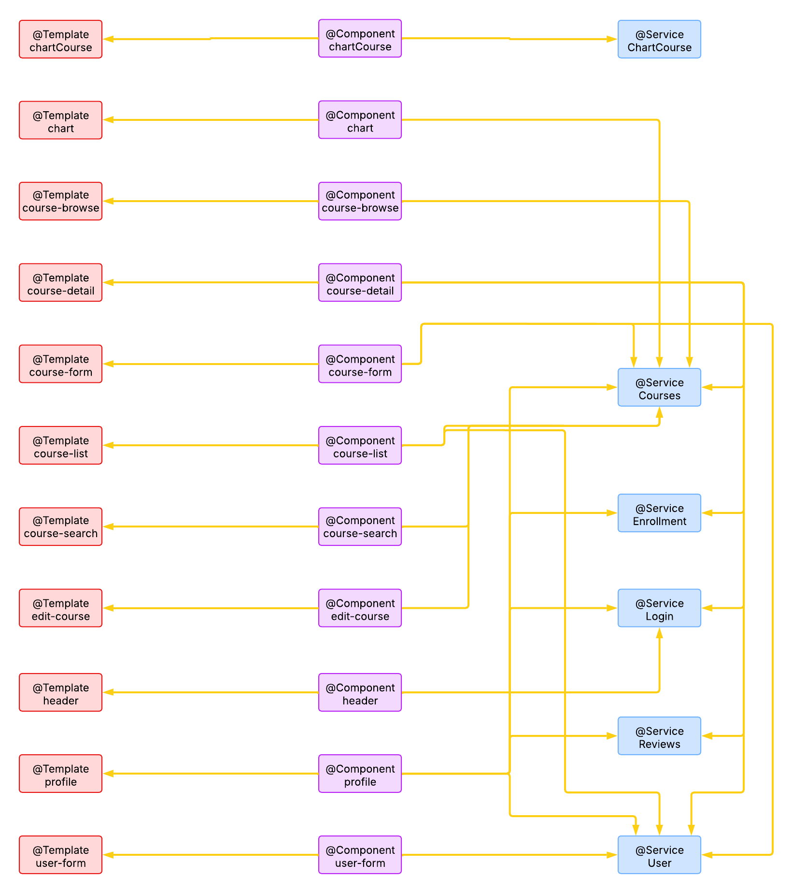

# Nombre de la aplicación: Cognite
## Integrantes:
| Nombre    | Email     | Github      |
|:-------------|:------------:|-------------:|
| Álvaro Fernández González       | a.fernandezgo.2020@alumnos.urjc.es       | [alvaro-f-g](https://github.com/alvaro-f-g)       |
| Gonzalo Fernández González       | g.fernandezg.2020@alumnos.urjc.es       | [gonfergon](https://github.com/gonfergon)     |
| Eloy de Sande de las Heras     | e.desande.2021@alumnos.urjc.es       | [eloydsdlh](https://github.com/eloydsdlh)  |
| Olga Somalo Serrano             |  o.somalo.2021@alumnos.urjc.es           |  [olga-ssf](https://github.com/olga-ssf)     |
| José Víctor García Llorente             |  jv.garcia.2021@alumnos.urjc.es           |  [josevictorgarcia](https://github.com/josevictorgarcia)     |

## Aspectos principales:
- **Entidades**: usuario, inscripción, curso, comentario
  
- **Permisos de usuario**:
  - Usuario registrado: Impartir o recibir cursos, ver y añadir comentarios.
  - Usuario anónimo o no registrado: Ver cursos impartidos, y acceder a las reseñas.
  - Administrador: Puede añadir, borrar o editar cursos y comentarios.
- **Imágenes**: Del perfil de los usuarios, y de los cursos impartidos.
- **Gráficos**: De las cursos recibidos e impartidos por el usuario y de las valoraciones.
- **Tecnología complementaria**: Envío  de correos a los usuarios indicándoles que  han sido eliminados.
- **Algoritmo o consulta avanzada**: Mostrar cursos de interés o afines al usuario, ordenados por valoración.

## Capturas de pantalla:
- **Página de inicio**:
  
  Es la pantalla principal. Desde ella se podrán observar los cursos disponibles, acceder a la pantalla de registro de usuarios y la de login.
- **Página de registro de usuarios:**
  
  Se trata de una página compuesta de un formulario en el cual los usuarios no registrados se darán de alta para poder inscribirse a cursos y hacer un uso más completo de la aplicación.
- **Página de login:**
  
  Se trata de otro formulario en el cual el usuario ya registrado introducirá sus credenciales de acceso para acceder a su cuenta.
- **Página de perfil de usuario:**
  
  
  En esta página el usuario registrado podrá editar su perfil, acceder a los cursos en los que se ha inscrito y los que ha subido, cerrar sesión y volver a la página de inicio.
- **Página de administrador:**
  
  En esta página, solo de acceso al administrador, podrá ver los comentarios reportados por los profesores y actuar frente a estos. También podrá buscar a un usuario para eleiminarle.
- **Formulario nuevo curso:**
  
  Formulario para que los usuarios registrados puedan añadir y crear un nuevo curso. Incluye subida de imágenes y ficheros.
- **Página de curso:**
  - Vista de administrador: El administrador tiene acceso a todos los materiales del curso. Puede editar, eliminar y ver las estadísticas del curso. También puede eliminar comentarios o banear usuarios.
  - Vista de profesor: El profesor tiene acceso a todos los materiales del curso. Puede editar, eliminar y ver las estadísticas del curso. Tiene la opción de añadir, responder o reportar comentarios.
  - Vista de alumno: El alumno tiene acceso a todos los materiales del curso. Puede añadir, responder comentarios y ańadir valoraciones.
  - Vista de usuario no inscrito: Solo tiene acceso a la información del curso, no a los materiales.
- **Página de estadísticas:**
  
  
  Se muestran estadísticas sobre un curso en concreto, por ejemplo la calificación promedio de un curso o el número de inscritos.
- **Página de error:** Se muestra cuando sucede algún tipo de error, mostrando un mensaje para informar al usuario de lo sucedido.
- **Página de categoría:**
  
  Se muestran los cursos de una determinada categoría.
- **Página de búsqueda:**
  
  Se muestras los cursos que contienen en su título y/o categoría la(s) palabra(s) buscadas.
  
## Diagrama de navegación:
- **Azul:** Todos los usuarios.
- **Amarillo:** Usuarios Registrados.
- **Verde:** Administrador.
- **Nota:** desde cualquier página puedes llegar a la página de error


## Diagrama con las entidades de la base de datos:


## Diagrama de clases y templates:


## Diagrama de clases y templates de la SPA:

## Instrucciones de Ejecución:  

## 1. Clonar el Repositorio y Configurar el Proyecto en VS Code  
1. ## Abre VS Code 
2. ## Clona el repositorio desde GitHub a través de VsCode (Git: Clone (Clone a repository from the internet)).
3. ## Ingresa la URL del repositorio (puedes copiarla desde GitHub haciendo clic en el botón "Code" > "HTTPS" o "SSH").
4. ## Selecciona la carpeta donde quieres clonar el proyecto.
5. ## Una vez clonado, VS Code te preguntará si quieres abrir el repositorio. Haz clic en "Open".
   **Requisitos técnicos**
   - Java JDK 21
   - MySQL v.8.0.33
   - Maven v4.0.0
   - Spring Boot v3.4.2
## 2. Configurar MySQL y Base de Datos 
1. ## Descarga e instala **MySQL Workbench** si no lo tienes.  
2. ## Abre MySQL Workbench y conéctate con:  
   - **Usuario**: `root`  
   - **Contraseña**: `password`  
   - **Puerto**: `3306`  
3. ## Crea el esquema ejecutando este comando en MySQL:  
   ```sql
   CREATE SCHEMA cognite;
   ```

## 3. Configurar y Ejecutar Docker
Si el proyecto utiliza **Docker**, sigue estos pasos para ejecutarlo:  
1. ## Asegúrate de tener Docker instalado (puedes descargarlo desde [Docker](https://www.docker.com/)).  
2. ## Abre el docker desktop** y correlo 


## 4. Ejecutar la Aplicación desde Spring Dashboard en VS Code 
Si el proyecto es una aplicación **Spring Boot**, puedes correrlo directamente desde **Spring Boot Dashboard** en VS Code:  
1. ## Asegúrate de tener instalada la extensión `Spring Boot Extension Pack` en VS Code.  
2. ## Abre la pestaña "Spring Boot Dashboard" en la barra lateral izquierda de VS Code.  
3. ## Selecciona la aplicación en la lista y haz clic en el botón ▶ (Run).  

## 5. Acceder a la Aplicación
Una vez ejecutado el servidor, accede desde el navegador a:  
🔗 **[https://localhost:8443/](https://localhost:8443/)**  

## Documentación API REST:
La API de Cognite proporciona endpoints para manejar cursos, inscripciones, reseñas y usuarios. La documentación de la API se ha generado con OpenAPI
1. **Acceso a OpenAPI YAML file**
    En el siguiente enlace: [OpenAPI Documentation yaml](/api-docs/api-docs.yaml).
 
 2. **Visualizar OpenAPI documentation html file**
    En el siguiente enlace: [OpenAPI Documentation html](https://raw.githack.com/CodeURJC-DAW-2024-25/webapp11/main/api-docs/api-docs.html).

##  Instalación e inicialización

1.  **Clonar el repositoorio**
```bash
git clone https://github.com/CodeURJC-DAW-2024-25/webapp11 Cognite --branch main --depth 1
```

2. **Construir la imagen Docker**
```bash

chmod +x docker/create_image.sh
docker/create_image.sh 1.0
```

3. **Ejecutar el contenedor Docker**
```bash
docker-compose -f docker/docker-compose.yml up --build
```

---

## 🚀 Despliegue en el servidor de la ETSII

Para desplegar la aplicación en el servidor de la ETSII, siga las siguientes instrucciones.
1.  **Instalar Docker**
[Ver documentación](https://docs.docker.com/engine/install/ubuntu/)

2. **Instalar Docker Compose**
[Ver documentación](https://docs.docker.com/compose/install/linux/#install-using-the-repository)
```
sudo apt install docker-compose
```
3. **Clonar el repositorio**
```
git clone https://github.com/CodeURJC-DAW-2024-25/webapp11.git
```
4. **Moverse a la carpeta webapp11 recién creada**
   
5. **Ejecutar el comando**
   ```
   sudo docker-compose -f docker/docker-compose.yml up --build
   ```


Para acceder a la aplicación, navege a `appWeb11.dawgis.etsii.urjc.es` o `10.100.139.135` en tu navegador web o establecer PostMan para interactuar con la API.

Por defecto, la aplicación tiene algunos usuarios y cursos creados para interactuar con la API:

> **Admin User**: 
> - Username: `admin@gmail.com`
> - Password: `1234`

> **Regular User**:
> - Username: `user1@gmail.com`
> - Password: `1234`

---
## Desarrollo en Angular
1. Clonar el repositorio:
   ```bash
      git clone https://github.com/CodeURJC-DAW-2024-25/webapp11 Cognite --branch main --depth 1
   ```
2. Moverse a la carpeta webapp11/Cognite e instalar dependencias:
- `cd Cognite`
- `npm install`

3. Generar los ficheros build de Angular:
- `ng build --configuration production --base-href="/new/" `

4. Copiar los ficheros generados a la carpeta static del backend. Moverse a la carpeta static y cambiar el nombre de la carpeta de 'browser' a 'new'. Esto es porque por defecto el comando del apartado 2 genera una carpeta llamada 'browser', pero nosotros queremos que esa carpeta se llame 'new':
- `cp -r dist/cognite/* ../demo/src/main/resources/static`
- `cd ../demo/src/main/resources/static`
- `mv browser new`

5. Ejecutar la aplicación Spring-Boot:
- Se puede hacer con la extensión de Spring Boot de VSC (pulsando el botón de ejecutar, como si fuesemos a ejecutar el backend)
- O bien se puede ejecutar moviéndonos a la carpeta donde se encuentra el pom.xml (`cd ../../../../` desde donde estamos, que sería la carpeta static) y ejecutando el comando `mvn spring-boot:run`
   Disponible en [http://localhost:4200/](http://localhost:4200/) 
Para acceder a la aplicación, navege a `appWeb11.dawgis.etsii.urjc.es` o `10.100.139.135` en tu navegador web. La parte de Angular estará disponible en `https://10.100.139.135:8443/new/` o `https:/appWeb11.dawgis.etsii.urjc.es:8443/new/`.
---
## Participación P1:
- Eloy de Sande.

  Entre las tareas desarrolladas cabe destacar: creación de las plantillas mustache, inicialización de la base de datos para contar con ejemplos de demostración, implementación del perfil y sus funciones asociadas (listar usuarios, listar comentarios pendientes de revisión, eliminar usuarios, ...), destacando la creación de `EmailService` para notificar a los usuarios que su cuenta ha sido eliminada. Implementación del algoritmo de consulta avanzada, que consiste en mostrar a los usuarios cursos relacionados con su temática de prefencia, atributo que se va actualizando acorde a las inscripciones del usuario.
  
 | Principales Commit | Descripción  | Enlace al Commit |
|--------------------|-------------|------------------|
| **Commit 1** | Creación de plantillas HTML en el directorio `demo/src/main/resources/templates` utilizando el motor de plantillas Mustache. | [Ver commit](https://github.com/CodeURJC-DAW-2024-25/webapp11/commit/eb4dbab69e28da30e0a3144e63682c826ad11da2) |
| **Commit 2** | Se añade la clase `SecurityConfiguration` en el paquete `es.daw.demo.security`, que configura la seguridad de la aplicación utilizando Spring Security. | [Ver commit](https://github.com/CodeURJC-DAW-2024-25/webapp11/commit/59548aba488c7f58f3f4e80db7143c0ea88d68df) |
| **Commit 3** | Se añade funcionalidad de notificación por correo electrónico de la eliminación de cuentas de usuario en la aplicación web. | [Ver commit](https://github.com/CodeURJC-DAW-2024-25/webapp11/commit/911b4e7e2efa6a91869b452f7d507f0c7ae2a749) |
| **Commit 4** | Se introducen mejoras en los servicios `EnrollmentService` y `ReviewService`. Se añaden nuevas funcionalidades o mejoras en la lógica de negocio de estos servicios para la gestión de inscripciones y revisiones dentro de la aplicación. | [Ver commit](https://github.com/CodeURJC-DAW-2024-25/webapp11/commit/a003aa65ebb25bfe120f271ff668d4c341d86847) |
| **Commit 5** | Se introducen funcionalidades de administración, permitiendo a los usuarios con rol de administrador acceder a una vista específica (`admin`) desde su perfil. Se añade una nueva ruta `/admin/users` que muestra una lista de usuarios, con la opción de filtrar por nombre, y se implementa la capacidad de eliminar usuarios mediante la ruta `/admin/users/delete/{id}`. | [Ver commit](https://github.com/CodeURJC-DAW-2024-25/webapp11/commit/cb1b624b6b906ee91eb8eab60d9a83abb49cabb0) |

  
  | Principales archivos | Enlace al archivo |
  |----------------------|-------------------|
  |EnrollmentController|[Ver archivo](demo/src/main/java/es/daw/demo/controller/EnrollmentController.java)|
  |User|[Ver archivo](demo/src/main/java/es/daw/demo/model/User.java)|
  |EmailService|[Ver archivo](demo/src/main/java/es/daw/demo/service/EmailService.java)|
  |UserService|[Ver archivo](demo/src/main/java/es/daw/demo/service/UserService.java)|
  |DataBaseInitializer|[Ver archivo](demo/src/main/java/es/daw/demo/service/DataBaseInitializer.java)|

  - Olga Somalo Serrano.

  Entre las tareas desarrolladas cabe destacar: inicialización de la base de datos, implementación del botón de cargar más elementos (tanto en la página principal como en el perfil). Implementación de las funcionalidades de borrar y editar cursos, así como borrar y editar perfil. Implemetación de las gráficas: top 5 categorías con más cursos, top 5 categorías con más incripciones y valoraciones de los cursos.

   | Principales Commit | Descripción  | Enlace al Commit |
|--------------------|-------------|------------------|
| **Commit 1** | Se añaden las funcionalidades de borrar y editar perfil añadiendo un formaulario en la página de perfil. | [Ver commit](https://github.com/CodeURJC-DAW-2024-25/webapp11/commit/a356e4921b97a085cd8a35cfec27833e33b5ca8c) |
| **Commit 2** | Se añade la gráfica de top 5 categorías con más cursos. | [Ver commit](https://github.com/CodeURJC-DAW-2024-25/webapp11/commit/b26abd00eddd5fd53b2bcfd8406d5b050cc21c83) |
| **Commit 3** | Se añade la funcionalidad de editar los cursos. | [Ver commit](https://github.com/CodeURJC-DAW-2024-25/webapp11/commit/ff1e2f92039c8d73a9c2ad7054678c08cee2588a) |
| **Commit 4** | Se añade la gráfica de categorías con más inscripciones. | [Ver commit](https://github.com/CodeURJC-DAW-2024-25/webapp11/commit/8d65f6aa320d6a1ff73d7d08a90d189edd078ff9) |
| **Commit 5** | Se añade la funcionalidad del botón de cargar más cursos en la página principal. | [Ver commit](https://github.com/CodeURJC-DAW-2024-25/webapp11/commit/cc029e895e93693e20547cb754e89eb98cce4a34) |

| Principales archivos | Enlace al archivo |
  |----------------------|-------------------|
  |charts.js|[Ver archivo](https://github.com/CodeURJC-DAW-2024-25/webapp11/blob/main/demo/src/main/resources/static/js/charts.js)|
  |app.js|[Ver archivo](https://github.com/CodeURJC-DAW-2024-25/webapp11/blob/main/demo/src/main/resources/static/js/app.js)|
  |chartsCourse.js|[Ver archivo](https://github.com/CodeURJC-DAW-2024-25/webapp11/blob/main/demo/src/main/resources/static/js/chartsCourse.js)|
  |CourseController|[Ver archivo](https://github.com/CodeURJC-DAW-2024-25/webapp11/blob/main/demo/src/main/java/es/daw/demo/controller/CourseController.java)|
  |UserController|[Ver archivo](https://github.com/CodeURJC-DAW-2024-25/webapp11/blob/main/demo/src/main/java/es/daw/demo/controller/UserController.java)|

  - José Víctor García Llorente.

  Entre las tareas desarrolladas cabe destacar: Implementación de la actualización y modificación del perfil de un usuario, así como el borrado de su cuenta. Creación de plantillas en páginas de error y estadísticas. Funcionalidades de añadir reviews y enlazar sub-reviews y mostrar la página de curso en función del tipo de usuario.


| Principales Commit | Descripción  | Enlace al Commit |
|--------------------|-------------|------------------|
| **Commit 1** | Actualización y modificación del perfil del administrador. Cambios en la configuración de rutas. | [Ver commit](https://github.com/CodeURJC-DAW-2024-25/webapp11/commit/60ff7660aac43ebda35eb584e26af767e5b8cd36) |
| **Commit 2** | Implementación de la plantilla de la página de error y estadísticas. | [Ver commit](https://github.com/CodeURJC-DAW-2024-25/webapp11/commit/c838b77b6899c55d1d831fa7621840ace17a436a) |
| **Commit 3** | Borrado del usuario desde el perfil. | [Ver commit](https://github.com/CodeURJC-DAW-2024-25/webapp11/commit/cbf52aec56912b6f319ffa7e340d085eb381b9c2) |
| **Commit 4** | Funcionalidad de añadir reviews y comentarios a los cursos. Enlace de las sub-reviews a las reviews. | [Ver commit](https://github.com/CodeURJC-DAW-2024-25/webapp11/commit/9ec686a013b5658640006b1494641fc19e2608ed) |
| **Commit 5** | Funcionalidad de mostrar página de un curso según el tipo de usuario. | [Ver commit](https://github.com/CodeURJC-DAW-2024-25/webapp11/commit/cbda04e7c6eff06a851e14480700dd9c3147d982) |

| Principales archivos | Enlace al archivo |
  |----------------------|-------------------|
  |UserController|[Ver archivo](https://github.com/CodeURJC-DAW-2024-25/webapp11/blob/main/demo/src/main/java/es/daw/demo/controller/UserController.java)|
  |ReviewController|[Ver archivo](https://github.com/CodeURJC-DAW-2024-25/webapp11/blob/main/demo/src/main/java/es/daw/demo/controller/ReviewController.java)|
  |WebSecurityConfig|[Ver archivo](https://github.com/CodeURJC-DAW-2024-25/webapp11/blob/main/demo/src/main/java/es/daw/demo/security/WebSecurityConfig.java)|
  |CourseController|[Ver archivo](https://github.com/CodeURJC-DAW-2024-25/webapp11/blob/main/demo/src/main/java/es/daw/demo/controller/CourseController.java)|
  |admin.html|[Ver archivo](https://github.com/CodeURJC-DAW-2024-25/webapp11/blob/main/demo/src/main/resources/templates/admin.html)|

  - Álvaro Fernández González

Entre las contribuciones realizadas por mi, cabe destacar la creación de controladores y repositorios para ciertas entidades como la del user, la creación de enitdad de reseñas para ser tratada en la BBDD, añadir todas las rutas de seguridad necesarias, añadir la seguridad CSRF en la edición de las reseñas, así como hacer el cógido más legible comprobando que todo estuviera en mismo idioma (inglés) entre otras contribuciones. A continuación, se presentan los principales commits realizados en el proyecto, junto con una breve descripción de los cambios introducidos en cada uno y un enlace al commit correspondiente:  

| **Principales Commit** | **Descripción** | **Enlace al Commit** |
|--------------------|-------------|------------------|
| **Commit 1** | Se añaden todas las rutas necesarias para los usuarios en la configuración de seguridad web. | [Ver commit](https://github.com/CodeURJC-DAW-2024-25/webapp11/commit/f5c0b0be0ac019b84a264d3bf02779b8629f5141)|
| **Commit 2** | Se añaden el controlador y el repositorio para gestionar los usuarios en la aplicación. | [Ver commit](https://github.com/CodeURJC-DAW-2024-25/webapp11/commit/42e3ea249cfeab34de231d5a55b659feae4921fa)|
| **Commit 3** | Se crea la entidad `Comment` para gestionar los comentarios dentro de la aplicación. | [Ver commit](https://github.com/CodeURJC-DAW-2024-25/webapp11/commit/f51229c03e79382b1bfee432d4e114a61ea7dc26)|
| **Commit 4** | Se añade protección CSRF en la edición de revisiones para mejorar la seguridad de la aplicación. | [Ver commit](https://github.com/CodeURJC-DAW-2024-25/webapp11/commit/6706a0cbfa0ba525fa1a1a573dedc5ef3ce9b28d)|
| **Commit 5** | Se traducen comentarios, funciones y otros elementos del código de español a inglés para mejorar la consistencia del proyecto. | [Ver commit](https://github.com/CodeURJC-DAW-2024-25/webapp11/commit/7a4fb41eb766a7b3ed4e527aa1ad68b35deabe8c)|

| Principales archivos | Enlace al archivo |
  |----------------------|-------------------|
  |EnrollmentController|[Ver archivo](https://github.com/CodeURJC-DAW-2024-25/webapp11/blob/main/demo/src/main/java/es/daw/demo/controller/EnrollmentController.java)|
  |EnrollmentRepository|[Ver archivo](https://github.com/CodeURJC-DAW-2024-25/webapp11/blob/main/demo/src/main/java/es/daw/demo/controller/EnrollmentController.java)|
  |ReviewController|[Ver archivo](https://github.com/CodeURJC-DAW-2024-25/webapp11/blob/main/demo/src/main/java/es/daw/demo/repository/EnrollmentRepository.java)|
  |WebSecurityConfig|[Ver archivo](https://github.com/CodeURJC-DAW-2024-25/webapp11/blob/main/demo/src/main/java/es/daw/demo/security/WebSecurityConfig.java)|
  |Review|[Ver archivo](https://github.com/CodeURJC-DAW-2024-25/webapp11/blob/main/demo/src/main/java/es/daw/demo/model/Review.java)|


-Gonzalo Fernández González

Entre las tareas realizadas cabe destacar: implementación del CourseRepository, implementación del CourseController, implementación del ReviewController, implementación del Enrollment service, implementación del Review service, implementación de botón para mejor navegabilidad, implementación para editar y borrar reseñas y agregación de formularios para editar y eliminar revisiones, refactorizar el personal de revisión en el curso y revisar controladores, corrección del botón Back to Courses.

   | Principales Commit | Descripción  | Enlace al Commit |
|--------------------|-------------|------------------|
| **Commit 1** |CourseController added | [Ver commit](https://github.com/CodeURJC-DAW-2024-25/webapp11/commit/e1715a0c6d832ec27911eb670a03d80cdf946cc9#diff-40e9664b7caf569650acacc7ff7e5227eb10059056ff75abc51433aeb4607c46) |
| **Commit 2** |Enrollment service added  | [Ver commit](https://github.com/CodeURJC-DAW-2024-25/webapp11/commit/beb89f56116ad569545ce3dd27376266cbdae7b4#diff-1f61c6528348e5faee4036bb781c7984d200a8297d18e1a5421722b1bcb5da1b) |
| **Commit 3** |Review service added | [Ver commit](https://github.com/CodeURJC-DAW-2024-25/webapp11/commit/782268940673fdd43f2b2f5cb5b42df76fa0c713#diff-b2aa078e0484e59e1b3b50f7c6777685b54051d60a63ad20be3a261bff1519df) |
| **Commit 4** |ReviewController added  | [Ver commit](https://github.com/CodeURJC-DAW-2024-25/webapp11/commit/4e2f79a5fea35c0f069e0a6f1e46c1f10b7e62c8#diff-db091f5cbad61dea1e59332a89061055fb18cd97737600324db0d0395107841d) |
| **Commit 5** |add forms to edit and delete review, refactor review staff in course and review controllers | [Ver commit](https://github.com/CodeURJC-DAW-2024-25/webapp11/commit/a9dfc042ed62f1c4b5de9aa77e264219302e75ad#diff-40e9664b7caf569650acacc7ff7e5227eb10059056ff75abc51433aeb4607c46)|[Ver commit](https://github.com/CodeURJC-DAW-2024-25/webapp11/commit/a9dfc042ed62f1c4b5de9aa77e264219302e75ad#diff-5d9357e33602093934d00045974812a477823ccea20dfe5b2a0826977961aa5f)|[Ver commit](https://github.com/CodeURJC-DAW-2024-25/webapp11/commit/a9dfc042ed62f1c4b5de9aa77e264219302e75ad#diff-5d9357e33602093934d00045974812a477823ccea20dfe5b2a0826977961aa5f) |


| Principales archivos | Enlace al archivo |
  |----------------------|-------------------|
  |ReviewController|[Ver archivo](https://github.com/CodeURJC-DAW-2024-25/webapp11/commit/4e2f79a5fea35c0f069e0a6f1e46c1f10b7e62c8#diff-db091f5cbad61dea1e59332a89061055fb18cd97737600324db0d0395107841d)|
  |CourseController|[Ver archivo](https://github.com/CodeURJC-DAW-2024-25/webapp11/commit/e1715a0c6d832ec27911eb670a03d80cdf946cc9#diff-40e9664b7caf569650acacc7ff7e5227eb10059056ff75abc51433aeb4607c46)|
  |Admin|[Ver archivo](https://github.com/CodeURJC-DAW-2024-25/webapp11/commit/a9dfc042ed62f1c4b5de9aa77e264219302e75ad#diff-3af6ce49f8a0478fa6d38bcbd811f1b6688ce9c4300a28f35fa09c6e3a93526b)|
  |Enrollment service|[Ver archivo](https://github.com/CodeURJC-DAW-2024-25/webapp11/commit/beb89f56116ad569545ce3dd27376266cbdae7b4#diff-1f61c6528348e5faee4036bb781c7984d200a8297d18e1a5421722b1bcb5da1b)|
  |Review service|[Ver archivo](https://github.com/CodeURJC-DAW-2024-25/webapp11/commit/782268940673fdd43f2b2f5cb5b42df76fa0c713#diff-b2aa078e0484e59e1b3b50f7c6777685b54051d60a63ad20be3a261bff1519df)|

## Participación P2:
- Eloy de Sande de las Heras

  Entre las tareas desarrolladas cabe destacar: creación de los DTOS para cada entidad (course, enrollment, review, user), implementación de la seguridad para la API Rest, creación de la documentación de la API, controladores para la API, ...
  
 | Principales Commit | Descripción  | Enlace al Commit |
|--------------------|-------------|------------------|
| **Commit 1** | Creación de documentación de la API | [Ver commit](https://github.com/CodeURJC-DAW-2024-25/webapp11/commit/115e35f978abcef1e462aab0d3cb7b6095affd48) |
| **Commit 2** | Creación UserApiController, ReviewApiController y EnrollmentApiController | [Ver commit](https://github.com/CodeURJC-DAW-2024-25/webapp11/commit/eaf35ca0b31816a204cb5bb3570eee356006119d) |
| **Commit 3** | Se añade  funcionalidad de seguridad para la API| [Ver commit](https://github.com/CodeURJC-DAW-2024-25/webapp11/commit/ae80df65c353fe1b75e3d64b3f2b5e1e242b549e) |
| **Commit 4** | Modificación se servicios y controladores para funcionar con la versión web y API | [Ver commit](https://github.com/CodeURJC-DAW-2024-25/webapp11/commit/af4b852d42f884496ccb418c7ea15c9bc3bcbded) |
| **Commit 5** | Creación DTOs y Mappers| [Ver commit](https://github.com/CodeURJC-DAW-2024-25/webapp11/commit/a3d5f3961bff50f84167b855d019c79597e3ec6c) |

  
  | Principales archivos | Enlace al archivo |
  |----------------------|-------------------|
  |API Docs yaml|[Ver archivo](api-docs/api-docs.yaml)|
  |CourseApiController|[Ver archivo](demo/src/main/java/es/daw/demo/controller/CourseApiController.java)|
  |UserApiController|[Ver archivo](demo/src/main/java/es/daw/demo/controller/UserApiController.java)|
  |ReviewApiController|[Ver archivo](demo/src/main/java/es/daw/demo/controller/ReviewApiController.java)|
  |SecurityConfig|[Ver archivo](demo/src/main/java/es/daw/demo/security/SecurityConfig.java)|

 - Álvaro Fernández González

Durante el desarrollo del proyecto, se han realizado diversas tareas clave entre las que destacan: creación algunos DTOS (`Course`, `Enrollment`, `Review`, `User`), implementación de cierta seguridad en la la API REST, documentación de endpoints, desarrollo de controladores REST...

|  Principales Commits | Descripción | Enlace |
|--------|-------------|--------|
| **Commit 1** | Creación de documentación de la API en Postman | [Ver commit](https://github.com/CodeURJC-DAW-2024-25/webapp11/commit/e40c2e4cfa843a61593cef976f6ff006c2135477) |
| **Commit 2** | Creación de RestUserController | [Ver commit](https://github.com/CodeURJC-DAW-2024-25/webapp11/commit/436fb879a553a79d25727b85f0c23a5d9fad746e) |
| **Commit 3** | Implementación de seguridad en EnrollmentApiController para controlar acceso de usuarios no autenticados | [Ver commit](https://github.com/CodeURJC-DAW-2024-25/webapp11/commit/ae381e009f1d8d06312c8d9495625c34ae041b75) |
| **Commit 4** | Refactorización de endpoints (`mark`, `desmark`, etc.) para ajustarse a los requisitos del frontend y la API | [Ver commit](https://github.com/CodeURJC-DAW-2024-25/webapp11/commit/0f39eef0b656cd3fdeb344bb0addefc6291c7bf2) |
| **Commit 5** | Creación de los DTOs (`ReviewDTO`, `CourseDTO`) | [Ver commit](https://github.com/CodeURJC-DAW-2024-25/webapp11/commit/4730adf0ef4de839792ebdeebbf03aec21a7239b) |

| Principales Archivos | Enlace al archivo |
|--------|--------|
| Documentación API (Postman Collection) | [Ver archivo](demo/DAWCognite.postman_collection.json) |
| UserApiController.java | [Ver archivo](demo/src/main/java/es/daw/demo/controller/UserApiController.java) |
| ReviewDTO.java | [Ver archivo](demo/src/main/java/es/daw/demo/dto/ReviewDTO.java) |
| EnrollmentApiController.java | [Ver archivo](demo/src/main/java/es/daw/demo/controller/EnrollmentApiController.java) |
| CourseDTO.java | [Ver archivo](demo/src/main/java/es/daw/demo/dto/CourseDTO.java) |


- Gonzalo Fernández González

Durante esta parte de la práctica, se han realizado las siguientes tareas:  creación algunos DTOS (`Course`, `Enrollment`), implementación y trabajo de la parte relativa al Docker...

|  Principales Commits | Descripción | Enlace |
|--------|-------------|--------|
| **Commit 1** | Creación de Enrollment DTO  | [Ver commit](https://github.com/CodeURJC-DAW-2024-25/webapp11/commit/630b1908d4275f7c9ff1138f336344083af81110) |
| **Commit 2** | Creación de CourseDTO | [Ver commit](https://github.com/CodeURJC-DAW-2024-25/webapp11/commit/07981cd65507b944e6b805760990953d204296dc) |
| **Commit 3** | Creación de la imagen de Docker | [Ver commit](https://github.com/CodeURJC-DAW-2024-25/webapp11/commit/0c1d6f0aa5da84982e0023f300d3f0c12815cfec) |
| **Commit 4** | Cambio de Puerto y Eliminar Docker Compose y Docker File malo  | [Ver commit](https://github.com/CodeURJC-DAW-2024-25/webapp11/commit/085c5bc2677999533a1e93bf897b389571494117) |
| **Commit 5** | Creación de DockerFile  | [Ver commit](https://github.com/CodeURJC-DAW-2024-25/webapp11/commit/0c1d6f0aa5da84982e0023f300d3f0c12815cfec) |

| Principales Archivos | Enlace al archivo |
|--------|--------|
|  Enrollment DTO.java | [Ver archivo](demo/src/main/java/es/daw/demo/DTO/EnrollmentDTO.java) |
| Course DTO.java | [Ver archivo](demo/src/main/java/es/daw/demo/DTO/CourseDTO.java) |
| create_image.sh | [Ver archivo](docker/create_image.sh) |
| DockerFile | [Ver archivo](docker/Dockerfile) |
| docker-compose.yml | [Ver archivo](docker/docker-compose.yml) |

- José Víctor García Llorente.

  En esta práctica se han llevado a cabo funciones relacionadas con despliegue y ejecución de la aplicación en el servidor remoto de la universidad. Destacando como tareas principales la creación y configuración de la carpeta Docker (Dockerfile, docker-compose.yml, create_image.sh, ...). Creación de imagen docker y corrección de errores en el código.


| Principales Commit | Descripción  | Enlace al Commit |
|--------------------|-------------|------------------|
| **Commit 1** | Creación de docker-compose.yml y Dockerfile. | [Ver commit](https://github.com/CodeURJC-DAW-2024-25/webapp11/commit/2ae3087f21dc6ebfb1817c11020c95edaff7d60b) |
| **Commit 2** | Despliegue: Creación de imagen en Docker Hub. | [Ver commit](https://github.com/CodeURJC-DAW-2024-25/webapp11/commit/9dfdf96651a84abda536b8ed0a905098a6c5e0a6) |
| **Commit 3** | Ejecución de imagen Docker: Corrección de un problema al inicializar los datos que impedía iniciar la aplicación durante el despliegue. | [Ver commit](https://github.com/CodeURJC-DAW-2024-25/webapp11/commit/fbb9ac45e739cb4b612611a1eee45fb0d5dfb5d4) |
| **Commit 4** | Corrección de errores al editar usuario. | [Ver commit](https://github.com/CodeURJC-DAW-2024-25/webapp11/commit/889b4ca025590b49e337e0c8cb5a4433b7744e57) |
| **Commit 5** | Funcionalidad de borrar usuario. | [Ver commit](https://github.com/CodeURJC-DAW-2024-25/webapp11/commit/cbf52aec56912b6f319ffa7e340d085eb381b9c2) |

| Principales archivos | Enlace al archivo |
  |----------------------|-------------------|
  |Dockerfile|[Ver archivo](https://github.com/CodeURJC-DAW-2024-25/webapp11/blob/main/docker/Dockerfile)|
  |docker-compose.yml|[Ver archivo](https://github.com/CodeURJC-DAW-2024-25/webapp11/blob/main/docker/docker-compose.yml)|
  |create_image.sh|[Ver archivo](https://github.com/CodeURJC-DAW-2024-25/webapp11/blob/main/docker/create_image.sh)|
  |DataBaseInitializer.java|[Ver archivo](https://github.com/CodeURJC-DAW-2024-25/webapp11/blob/main/demo/src/main/java/es/daw/demo/service/DataBaseInitializer.java)|
  |UserWebController.java|[Ver archivo](https://github.com/CodeURJC-DAW-2024-25/webapp11/blob/main/demo/src/main/java/es/daw/demo/controller/UserWebController.java)|


  - Olga Somalo Serrano.

  Entre las tareas realizadas cabe destacar: refactorizar los servicios para que usen DTOs, refactorizar los controladores web para que se adapten a la nueva interfaz de los servicios, e implementar los controladores REST y la colección Postman.


| Principales Commit | Descripción  | Enlace al Commit |
|--------------------|-------------|------------------|
| **Commit 1** | Actualizar colección Postman añadiendo variable de entorno y corrigiendo errores. | [Ver commit](https://github.com/CodeURJC-DAW-2024-25/webapp11/commit/d1f8adb2f8d05a5886316a003506634bd06e5ce9) |
| **Commit 2** | Actualizar colección Postman añadiendo la obtención de las reseñas por curso. | [Ver commit](https://github.com/CodeURJC-DAW-2024-25/webapp11/commit/9a3d766d5a913c2975996aabd862e50ff9df4432) |
| **Commit 3** | Implementar los métodos para editar las reseñas. | [Ver commit](https://github.com/CodeURJC-DAW-2024-25/webapp11/commit/99506c4f167697b61bcea712c3cffac83c90cfa1) |
| **Commit 4** | Añadir en la colección Postman las peticiones relacionadas con la creación de las reseñas. | [Ver commit](https://github.com/CodeURJC-DAW-2024-25/webapp11/commit/81ddd8df1bdcd5ecb6d37fbf4c404a62cd041d6f) |
| **Commit 5** | Refactorizar los controladores del login y los cursos. | [Ver commit](https://github.com/CodeURJC-DAW-2024-25/webapp11/commit/1f383097c876ff851779db2388e1238d2820b02a) |

| Principales archivos | Enlace al archivo |
  |----------------------|-------------------|
  |DAW Cognite.postman_collection.json|[Ver archivo](https://github.com/CodeURJC-DAW-2024-25/webapp11/blob/main/DAW%20Cognite.postman_collection.json)|
  |ReviewService.java|[Ver archivo](https://github.com/CodeURJC-DAW-2024-25/webapp11/blame/main/demo/src/main/java/es/daw/demo/service/ReviewService.java)|
  |LoginWebController.java|[Ver archivo](https://github.com/CodeURJC-DAW-2024-25/webapp11/blob/main/demo/src/main/java/es/daw/demo/controller/LoginWebController.java)|
  |NewCourseRequestDTO.java|[Ver archivo](https://github.com/CodeURJC-DAW-2024-25/webapp11/blob/main/demo/src/main/java/es/daw/demo/dto/NewCourseRequestDTO.java)|
  |CourseService.java|[Ver archivo](https://github.com/CodeURJC-DAW-2024-25/webapp11/blob/main/demo/src/main/java/es/daw/demo/service/CourseService.java)|


## Participación P3:
- Eloy de Sande de las Heras

  Entre las tareas desarrolladas cabe destacar la creación de algunos componentes, templates y servicios como: user.service, enrollment.service, course-list (componente y template), course-detail (componente y template), profile (component y template), ...
  
 | Principales Commit | Descripción  | Enlace al Commit |
|--------------------|-------------|------------------|
| **Commit 1** | Creación del template y componente para crear nuevos cursos, actualizando course.service | [Ver commit](https://github.com/CodeURJC-DAW-2024-25/webapp11/commit/0fe2fdef3a08baa91b975c03d181abdf262b21e2) |
| **Commit 2** | Creación del template y componente para crear nuevos usuarios | [Ver commit](https://github.com/CodeURJC-DAW-2024-25/webapp11/commit/43208bd379a83823b0df4cc4d8bfc0f5adc8d831) |
| **Commit 3** | Creación de los templates y componentes para buscar cursos y filtrar por categoría| [Ver commit](https://github.com/CodeURJC-DAW-2024-25/webapp11/commit/e03c4c988bea3c2acf1c835927a18110c879fcb2) |
| **Commit 4** | Creación del template y componente del perfil del usuario, | [Ver commit](https://github.com/CodeURJC-DAW-2024-25/webapp11/commit/d5cc9db8df96a8a9d662224be24f6a3f848cf8c3) |
| **Commit 5** | Creación del template y componente para mostrar los detalles de un curso| [Ver commit](https://github.com/CodeURJC-DAW-2024-25/webapp11/commit/8494d0814af44fbe0d6af4c1aedbbc81f1a73f90) |

  
  | Principales archivos | Enlace al archivo |
  |----------------------|-------------------|
  |course-form.component.ts|[Ver archivo](Cognite/src/app/components/course-form.component.ts)|
  |signup.component.ts|[Ver archivo](Cognite/src/app/components/signup.component.ts)|
  |course-search.component.ts|[Ver archivo](Cognite/src/app/components/course-search.component.ts)|
  |course-browse.component.ts|[Ver archivo](Cognite/src/app/components/course-browse.component.ts)|
  |profile-component.ts|[Ver archivo](Cognite/src/app/components/profile.component.ts)|


  - Olga Somalo Serrano

Entre las tareas realizadas cabe destacar: las funcionalidades de eliminar curso y editar curso (creando un componente para ello). También, el formulario de edición del perfil y la funcionalidad de eliminar perfil, creando el componente relacionado con el perfil de usuario y el servicio del usuario.
  
 | Principales Commit | Descripción  | Enlace al Commit |
|--------------------|-------------|------------------|
| **Commit 1** | Creación del template y componente del perfil de usuario y creación de user.service | [Ver commit](https://github.com/CodeURJC-DAW-2024-25/webapp11/commit/b8e4e4f9752fc94a7ae465f19acfd9334c6ee2f9) |
| **Commit 2** | Creación del template y componente para editar los cursos | [Ver commit](https://github.com/CodeURJC-DAW-2024-25/webapp11/commit/ef73ee0deb19072f6dd952ffa9670d1925448d81) |
| **Commit 3** | Mostrar los cursos impartidos en el perfil de usuario| [Ver commit](https://github.com/CodeURJC-DAW-2024-25/webapp11/commit/2571696038e7bb45fde8e3445bdc4e03c9e861c8) |
| **Commit 4** | Mejorar la edición del curso con un modal y con la posibilidad de cambiar la imagen y las notas | [Ver commit](https://github.com/CodeURJC-DAW-2024-25/webapp11/commit/6840ac13f4877426c8906d9b708eb8052ef0f665) |
| **Commit 5** | Añadir la funcionalidad de eliminar la cuenta | [Ver commit](https://github.com/CodeURJC-DAW-2024-25/webapp11/commit/d6673243f78f2062e298ecb60569f14ff4d58492) |

  
  | Principales archivos | Enlace al archivo |
  |----------------------|-------------------|
  |edit-course.component.ts|[Ver archivo](https://github.com/CodeURJC-DAW-2024-25/webapp11/blob/main/Cognite/src/app/components/edit-course.component.ts)|
  |edit-course.component.html|[Ver archivo](https://github.com/CodeURJC-DAW-2024-25/webapp11/blob/main/Cognite/src/app/components/edit-course.component.html)|
  |profile.component.ts|[Ver archivo](https://github.com/CodeURJC-DAW-2024-25/webapp11/blob/main/Cognite/src/app/components/profile.component.ts)|
  |courses.service.ts|[Ver archivo](https://github.com/CodeURJC-DAW-2024-25/webapp11/blob/main/Cognite/src/app/services/courses.service.ts)|
  |user.service.ts|[Ver archivo](https://github.com/CodeURJC-DAW-2024-25/webapp11/blob/main/Cognite/src/app/services/user.service.ts)|

- José Víctor García Llorente

Entre las tareas realizadas cabe destacar: Las funcionalidades de añadir review y sub-reviews dentro de cada curso. También se han realizado tareas respecto al despliegue de Angular (modificación del Dockerfile) y despliegue en máquina virtual.
  
 | Principales Commit | Descripción  | Enlace al Commit |
|--------------------|-------------|------------------|
| **Commit 1** | Añadir reviews a un curso | [Ver commit](https://github.com/CodeURJC-DAW-2024-25/webapp11/commit/8ae38317076344779c6f48606001462c5136cf5c) |
| **Commit 2** | Añadir sub-reviews | [Ver commit](https://github.com/CodeURJC-DAW-2024-25/webapp11/commit/6fb2eade747001dd162b66bb1b39e9206e61646a) |
| **Commit 3** | Actualización de Dockerfile| [Ver commit](https://github.com/CodeURJC-DAW-2024-25/webapp11/commit/ca06804d2d35fbf097ecf3a49919000e1b69b509) |
| **Commit 4** | Preparación para el despliegue con frontend Angular | [Ver commit](https://github.com/CodeURJC-DAW-2024-25/webapp11/commit/5499983c1f0d0d9eebfdc561324a790836639ece) |
| **Commit 5** | Versión final del Dockerfile | [Ver commit](https://github.com/CodeURJC-DAW-2024-25/webapp11/commit/5f3b5a9d077b4baf411096b6e9f8492d54c21e34) |

  
  | Principales archivos | Enlace al archivo |
  |----------------------|-------------------|
  |course-detail.component.html|[Ver archivo](https://github.com/CodeURJC-DAW-2024-25/webapp11/blob/main/Cognite/src/app/components/course-detail.component.html)|
  |course-detail.component.ts|[Ver archivo](https://github.com/CodeURJC-DAW-2024-25/webapp11/blob/main/Cognite/src/app/components/course-detail.component.ts)|
  |reviews.service.ts|[Ver archivo](https://github.com/CodeURJC-DAW-2024-25/webapp11/blob/main/Cognite/src/app/services/reviews.service.ts)|
  |SPAController.java|[Ver archivo](https://github.com/CodeURJC-DAW-2024-25/webapp11/blob/main/demo/src/main/java/es/daw/demo/controller/SPAController.java)|
  |Dockerfile|[Ver archivo](https://github.com/CodeURJC-DAW-2024-25/webapp11/blob/main/docker/Dockerfile)|

# Nombre de la aplicación: Cognite
## Integrantes:
| Nombre    | Email     | Github      |
|:-------------|:------------:|-------------:|
| Álvaro Fernández González       | a.fernandezgo.2020@alumnos.urjc.es       | [alvaro-f-g](https://github.com/alvaro-f-g)       |
| Gonzalo Fernández González       | g.fernandezg.2020@alumnos.urjc.es       | [gonfergon](https://github.com/gonfergon)     |
| Eloy de Sande de las Heras     | e.desande.2021@alumnos.urjc.es       | [eloydsdlh](https://github.com/eloydsdlh)  |
| Olga Somalo Serrano             |  o.somalo.2021@alumnos.urjc.es           |  [olga-ssf](https://github.com/olga-ssf)     |
| José Víctor García Llorente             |  jv.garcia.2021@alumnos.urjc.es           |  [josevictorgarcia](https://github.com/josevictorgarcia)     |

## Aspectos principales:
- **Entidades**: usuario, inscripción, curso, comentario
  
- **Permisos de usuario**:
  - Usuario registrado: Impartir o recibir cursos, ver y añadir comentarios.
  - Usuario anónimo o no registrado: Ver cursos impartidos, y acceder a las reseñas.
  - Administrador: Puede añadir, borrar o editar cursos y comentarios.
- **Imágenes**: Del perfil de los usuarios, y de los cursos impartidos.
- **Gráficos**: De las cursos recibidos e impartidos por el usuario y de las valoraciones.
- **Tecnología complementaria**: Envío  de correos a los usuarios indicándoles que  han sido eliminados.
- **Algoritmo o consulta avanzada**: Mostrar cursos de interés o afines al usuario, ordenados por valoración.

## Capturas de pantalla:
- **Página de inicio**:
  
  Es la pantalla principal. Desde ella se podrán observar los cursos disponibles, acceder a la pantalla de registro de usuarios y la de login.
- **Página de registro de usuarios:**
  
  Se trata de una página compuesta de un formulario en el cual los usuarios no registrados se darán de alta para poder inscribirse a cursos y hacer un uso más completo de la aplicación.
- **Página de login:**
  
  Se trata de otro formulario en el cual el usuario ya registrado introducirá sus credenciales de acceso para acceder a su cuenta.
- **Página de perfil de usuario:**
  
  
  En esta página el usuario registrado podrá editar su perfil, acceder a los cursos en los que se ha inscrito y los que ha subido, cerrar sesión y volver a la página de inicio.
- **Página de administrador:**
  
  En esta página, solo de acceso al administrador, podrá ver los comentarios reportados por los profesores y actuar frente a estos. También podrá buscar a un usuario para eleiminarle.
- **Formulario nuevo curso:**
  
  Formulario para que los usuarios registrados puedan añadir y crear un nuevo curso. Incluye subida de imágenes y ficheros.
- **Página de curso:**
  - Vista de administrador: El administrador tiene acceso a todos los materiales del curso. Puede editar, eliminar y ver las estadísticas del curso. También puede eliminar comentarios o banear usuarios.
  - Vista de profesor: El profesor tiene acceso a todos los materiales del curso. Puede editar, eliminar y ver las estadísticas del curso. Tiene la opción de añadir, responder o reportar comentarios.
  - Vista de alumno: El alumno tiene acceso a todos los materiales del curso. Puede añadir, responder comentarios y ańadir valoraciones.
  - Vista de usuario no inscrito: Solo tiene acceso a la información del curso, no a los materiales.
- **Página de estadísticas:**
  
  
  Se muestran estadísticas sobre un curso en concreto, por ejemplo la calificación promedio de un curso o el número de inscritos.
- **Página de error:** Se muestra cuando sucede algún tipo de error, mostrando un mensaje para informar al usuario de lo sucedido.
- **Página de categoría:**
  
  Se muestran los cursos de una determinada categoría.
- **Página de búsqueda:**
  
  Se muestras los cursos que contienen en su título y/o categoría la(s) palabra(s) buscadas.
  
## Diagrama de navegación:
- **Azul:** Todos los usuarios.
- **Amarillo:** Usuarios Registrados.
- **Verde:** Administrador.
- **Nota:** desde cualquier página puedes llegar a la página de error


## Diagrama con las entidades de la base de datos:


## Diagrama de clases y templates:


## Diagrama de clases y templates de la SPA:

## Instrucciones de Ejecución:  

## 1. Clonar el Repositorio y Configurar el Proyecto en VS Code  
1. ## Abre VS Code 
2. ## Clona el repositorio desde GitHub a través de VsCode (Git: Clone (Clone a repository from the internet)).
3. ## Ingresa la URL del repositorio (puedes copiarla desde GitHub haciendo clic en el botón "Code" > "HTTPS" o "SSH").
4. ## Selecciona la carpeta donde quieres clonar el proyecto.
5. ## Una vez clonado, VS Code te preguntará si quieres abrir el repositorio. Haz clic en "Open".
   **Requisitos técnicos**
   - Java JDK 21
   - MySQL v.8.0.33
   - Maven v4.0.0
   - Spring Boot v3.4.2
## 2. Configurar MySQL y Base de Datos 
1. ## Descarga e instala **MySQL Workbench** si no lo tienes.  
2. ## Abre MySQL Workbench y conéctate con:  
   - **Usuario**: `root`  
   - **Contraseña**: `password`  
   - **Puerto**: `3306`  
3. ## Crea el esquema ejecutando este comando en MySQL:  
   ```sql
   CREATE SCHEMA cognite;
   ```

## 3. Configurar y Ejecutar Docker
Si el proyecto utiliza **Docker**, sigue estos pasos para ejecutarlo:  
1. ## Asegúrate de tener Docker instalado (puedes descargarlo desde [Docker](https://www.docker.com/)).  
2. ## Abre el docker desktop** y correlo 


## 4. Ejecutar la Aplicación desde Spring Dashboard en VS Code 
Si el proyecto es una aplicación **Spring Boot**, puedes correrlo directamente desde **Spring Boot Dashboard** en VS Code:  
1. ## Asegúrate de tener instalada la extensión `Spring Boot Extension Pack` en VS Code.  
2. ## Abre la pestaña "Spring Boot Dashboard" en la barra lateral izquierda de VS Code.  
3. ## Selecciona la aplicación en la lista y haz clic en el botón ▶ (Run).  

## 5. Acceder a la Aplicación
Una vez ejecutado el servidor, accede desde el navegador a:  
🔗 **[https://localhost:8443/](https://localhost:8443/)**  

## Documentación API REST:
La API de Cognite proporciona endpoints para manejar cursos, inscripciones, reseñas y usuarios. La documentación de la API se ha generado con OpenAPI
1. **Acceso a OpenAPI YAML file**
    En el siguiente enlace: [OpenAPI Documentation yaml](/api-docs/api-docs.yaml).
 
 2. **Visualizar OpenAPI documentation html file**
    En el siguiente enlace: [OpenAPI Documentation html](https://raw.githack.com/CodeURJC-DAW-2024-25/webapp11/main/api-docs/api-docs.html).

##  Instalación e inicialización

1.  **Clonar el repositoorio**
```bash
git clone https://github.com/CodeURJC-DAW-2024-25/webapp11 Cognite --branch main --depth 1
```

2. **Construir la imagen Docker**
```bash

chmod +x docker/create_image.sh
docker/create_image.sh 1.0
```

3. **Ejecutar el contenedor Docker**
```bash
docker-compose -f docker/docker-compose.yml up --build
```

---

## 🚀 Despliegue en el servidor de la ETSII

Para desplegar la aplicación en el servidor de la ETSII, siga las siguientes instrucciones.
1.  **Instalar Docker**
[Ver documentación](https://docs.docker.com/engine/install/ubuntu/)

2. **Instalar Docker Compose**
[Ver documentación](https://docs.docker.com/compose/install/linux/#install-using-the-repository)
```
sudo apt install docker-compose
```
3. **Clonar el repositorio**
```
git clone https://github.com/CodeURJC-DAW-2024-25/webapp11.git
```
4. **Moverse a la carpeta webapp11 recién creada**
   
5. **Ejecutar el comando**
   ```
   sudo docker-compose -f docker/docker-compose.yml up --build
   ```


Para acceder a la aplicación, navege a `appWeb11.dawgis.etsii.urjc.es` o `10.100.139.135` en tu navegador web o establecer PostMan para interactuar con la API.

Por defecto, la aplicación tiene algunos usuarios y cursos creados para interactuar con la API:

> **Admin User**: 
> - Username: `admin@gmail.com`
> - Password: `1234`

> **Regular User**:
> - Username: `user1@gmail.com`
> - Password: `1234`

---
## Desarrollo en Angular
1. Clonar el repositorio:
   ```bash
      git clone https://github.com/CodeURJC-DAW-2024-25/webapp11 Cognite --branch main --depth 1
   ```
2. Moverse a la carpeta webapp11/Cognite e instalar dependencias:
- `cd Cognite`
- `npm install`

3. Generar los ficheros build de Angular:
- `ng build --configuration production --base-href="/new/" `

4. Copiar los ficheros generados a la carpeta static del backend. Moverse a la carpeta static y cambiar el nombre de la carpeta de 'browser' a 'new'. Esto es porque por defecto el comando del apartado 2 genera una carpeta llamada 'browser', pero nosotros queremos que esa carpeta se llame 'new':
- `cp -r dist/cognite/* ../demo/src/main/resources/static`
- `cd ../demo/src/main/resources/static`
- `mv browser new`

5. Ejecutar la aplicación Spring-Boot:
- Se puede hacer con la extensión de Spring Boot de VSC (pulsando el botón de ejecutar, como si fuesemos a ejecutar el backend)
- O bien se puede ejecutar moviéndonos a la carpeta donde se encuentra el pom.xml (`cd ../../../../` desde donde estamos, que sería la carpeta static) y ejecutando el comando `mvn spring-boot:run`
   Disponible en [http://localhost:4200/](http://localhost:4200/) 
Para acceder a la aplicación, navege a `appWeb11.dawgis.etsii.urjc.es` o `10.100.139.135` en tu navegador web. La parte de Angular estará disponible en `https://10.100.139.135:8443/new/` o `https:/appWeb11.dawgis.etsii.urjc.es:8443/new/`.
---
## Participación P1:
- Eloy de Sande.

  Entre las tareas desarrolladas cabe destacar: creación de las plantillas mustache, inicialización de la base de datos para contar con ejemplos de demostración, implementación del perfil y sus funciones asociadas (listar usuarios, listar comentarios pendientes de revisión, eliminar usuarios, ...), destacando la creación de `EmailService` para notificar a los usuarios que su cuenta ha sido eliminada. Implementación del algoritmo de consulta avanzada, que consiste en mostrar a los usuarios cursos relacionados con su temática de prefencia, atributo que se va actualizando acorde a las inscripciones del usuario.
  
 | Principales Commit | Descripción  | Enlace al Commit |
|--------------------|-------------|------------------|
| **Commit 1** | Creación de plantillas HTML en el directorio `demo/src/main/resources/templates` utilizando el motor de plantillas Mustache. | [Ver commit](https://github.com/CodeURJC-DAW-2024-25/webapp11/commit/eb4dbab69e28da30e0a3144e63682c826ad11da2) |
| **Commit 2** | Se añade la clase `SecurityConfiguration` en el paquete `es.daw.demo.security`, que configura la seguridad de la aplicación utilizando Spring Security. | [Ver commit](https://github.com/CodeURJC-DAW-2024-25/webapp11/commit/59548aba488c7f58f3f4e80db7143c0ea88d68df) |
| **Commit 3** | Se añade funcionalidad de notificación por correo electrónico de la eliminación de cuentas de usuario en la aplicación web. | [Ver commit](https://github.com/CodeURJC-DAW-2024-25/webapp11/commit/911b4e7e2efa6a91869b452f7d507f0c7ae2a749) |
| **Commit 4** | Se introducen mejoras en los servicios `EnrollmentService` y `ReviewService`. Se añaden nuevas funcionalidades o mejoras en la lógica de negocio de estos servicios para la gestión de inscripciones y revisiones dentro de la aplicación. | [Ver commit](https://github.com/CodeURJC-DAW-2024-25/webapp11/commit/a003aa65ebb25bfe120f271ff668d4c341d86847) |
| **Commit 5** | Se introducen funcionalidades de administración, permitiendo a los usuarios con rol de administrador acceder a una vista específica (`admin`) desde su perfil. Se añade una nueva ruta `/admin/users` que muestra una lista de usuarios, con la opción de filtrar por nombre, y se implementa la capacidad de eliminar usuarios mediante la ruta `/admin/users/delete/{id}`. | [Ver commit](https://github.com/CodeURJC-DAW-2024-25/webapp11/commit/cb1b624b6b906ee91eb8eab60d9a83abb49cabb0) |

  
  | Principales archivos | Enlace al archivo |
  |----------------------|-------------------|
  |EnrollmentController|[Ver archivo](demo/src/main/java/es/daw/demo/controller/EnrollmentController.java)|
  |User|[Ver archivo](demo/src/main/java/es/daw/demo/model/User.java)|
  |EmailService|[Ver archivo](demo/src/main/java/es/daw/demo/service/EmailService.java)|
  |UserService|[Ver archivo](demo/src/main/java/es/daw/demo/service/UserService.java)|
  |DataBaseInitializer|[Ver archivo](demo/src/main/java/es/daw/demo/service/DataBaseInitializer.java)|

  - Olga Somalo Serrano.

  Entre las tareas desarrolladas cabe destacar: inicialización de la base de datos, implementación del botón de cargar más elementos (tanto en la página principal como en el perfil). Implementación de las funcionalidades de borrar y editar cursos, así como borrar y editar perfil. Implemetación de las gráficas: top 5 categorías con más cursos, top 5 categorías con más incripciones y valoraciones de los cursos.

   | Principales Commit | Descripción  | Enlace al Commit |
|--------------------|-------------|------------------|
| **Commit 1** | Se añaden las funcionalidades de borrar y editar perfil añadiendo un formaulario en la página de perfil. | [Ver commit](https://github.com/CodeURJC-DAW-2024-25/webapp11/commit/a356e4921b97a085cd8a35cfec27833e33b5ca8c) |
| **Commit 2** | Se añade la gráfica de top 5 categorías con más cursos. | [Ver commit](https://github.com/CodeURJC-DAW-2024-25/webapp11/commit/b26abd00eddd5fd53b2bcfd8406d5b050cc21c83) |
| **Commit 3** | Se añade la funcionalidad de editar los cursos. | [Ver commit](https://github.com/CodeURJC-DAW-2024-25/webapp11/commit/ff1e2f92039c8d73a9c2ad7054678c08cee2588a) |
| **Commit 4** | Se añade la gráfica de categorías con más inscripciones. | [Ver commit](https://github.com/CodeURJC-DAW-2024-25/webapp11/commit/8d65f6aa320d6a1ff73d7d08a90d189edd078ff9) |
| **Commit 5** | Se añade la funcionalidad del botón de cargar más cursos en la página principal. | [Ver commit](https://github.com/CodeURJC-DAW-2024-25/webapp11/commit/cc029e895e93693e20547cb754e89eb98cce4a34) |

| Principales archivos | Enlace al archivo |
  |----------------------|-------------------|
  |charts.js|[Ver archivo](https://github.com/CodeURJC-DAW-2024-25/webapp11/blob/main/demo/src/main/resources/static/js/charts.js)|
  |app.js|[Ver archivo](https://github.com/CodeURJC-DAW-2024-25/webapp11/blob/main/demo/src/main/resources/static/js/app.js)|
  |chartsCourse.js|[Ver archivo](https://github.com/CodeURJC-DAW-2024-25/webapp11/blob/main/demo/src/main/resources/static/js/chartsCourse.js)|
  |CourseController|[Ver archivo](https://github.com/CodeURJC-DAW-2024-25/webapp11/blob/main/demo/src/main/java/es/daw/demo/controller/CourseController.java)|
  |UserController|[Ver archivo](https://github.com/CodeURJC-DAW-2024-25/webapp11/blob/main/demo/src/main/java/es/daw/demo/controller/UserController.java)|

  - José Víctor García Llorente.

  Entre las tareas desarrolladas cabe destacar: Implementación de la actualización y modificación del perfil de un usuario, así como el borrado de su cuenta. Creación de plantillas en páginas de error y estadísticas. Funcionalidades de añadir reviews y enlazar sub-reviews y mostrar la página de curso en función del tipo de usuario.


| Principales Commit | Descripción  | Enlace al Commit |
|--------------------|-------------|------------------|
| **Commit 1** | Actualización y modificación del perfil del administrador. Cambios en la configuración de rutas. | [Ver commit](https://github.com/CodeURJC-DAW-2024-25/webapp11/commit/60ff7660aac43ebda35eb584e26af767e5b8cd36) |
| **Commit 2** | Implementación de la plantilla de la página de error y estadísticas. | [Ver commit](https://github.com/CodeURJC-DAW-2024-25/webapp11/commit/c838b77b6899c55d1d831fa7621840ace17a436a) |
| **Commit 3** | Borrado del usuario desde el perfil. | [Ver commit](https://github.com/CodeURJC-DAW-2024-25/webapp11/commit/cbf52aec56912b6f319ffa7e340d085eb381b9c2) |
| **Commit 4** | Funcionalidad de añadir reviews y comentarios a los cursos. Enlace de las sub-reviews a las reviews. | [Ver commit](https://github.com/CodeURJC-DAW-2024-25/webapp11/commit/9ec686a013b5658640006b1494641fc19e2608ed) |
| **Commit 5** | Funcionalidad de mostrar página de un curso según el tipo de usuario. | [Ver commit](https://github.com/CodeURJC-DAW-2024-25/webapp11/commit/cbda04e7c6eff06a851e14480700dd9c3147d982) |

| Principales archivos | Enlace al archivo |
  |----------------------|-------------------|
  |UserController|[Ver archivo](https://github.com/CodeURJC-DAW-2024-25/webapp11/blob/main/demo/src/main/java/es/daw/demo/controller/UserController.java)|
  |ReviewController|[Ver archivo](https://github.com/CodeURJC-DAW-2024-25/webapp11/blob/main/demo/src/main/java/es/daw/demo/controller/ReviewController.java)|
  |WebSecurityConfig|[Ver archivo](https://github.com/CodeURJC-DAW-2024-25/webapp11/blob/main/demo/src/main/java/es/daw/demo/security/WebSecurityConfig.java)|
  |CourseController|[Ver archivo](https://github.com/CodeURJC-DAW-2024-25/webapp11/blob/main/demo/src/main/java/es/daw/demo/controller/CourseController.java)|
  |admin.html|[Ver archivo](https://github.com/CodeURJC-DAW-2024-25/webapp11/blob/main/demo/src/main/resources/templates/admin.html)|

  - Álvaro Fernández González

Entre las contribuciones realizadas por mi, cabe destacar la creación de controladores y repositorios para ciertas entidades como la del user, la creación de enitdad de reseñas para ser tratada en la BBDD, añadir todas las rutas de seguridad necesarias, añadir la seguridad CSRF en la edición de las reseñas, así como hacer el cógido más legible comprobando que todo estuviera en mismo idioma (inglés) entre otras contribuciones. A continuación, se presentan los principales commits realizados en el proyecto, junto con una breve descripción de los cambios introducidos en cada uno y un enlace al commit correspondiente:  

| **Principales Commit** | **Descripción** | **Enlace al Commit** |
|--------------------|-------------|------------------|
| **Commit 1** | Se añaden todas las rutas necesarias para los usuarios en la configuración de seguridad web. | [Ver commit](https://github.com/CodeURJC-DAW-2024-25/webapp11/commit/f5c0b0be0ac019b84a264d3bf02779b8629f5141)|
| **Commit 2** | Se añaden el controlador y el repositorio para gestionar los usuarios en la aplicación. | [Ver commit](https://github.com/CodeURJC-DAW-2024-25/webapp11/commit/42e3ea249cfeab34de231d5a55b659feae4921fa)|
| **Commit 3** | Se crea la entidad `Comment` para gestionar los comentarios dentro de la aplicación. | [Ver commit](https://github.com/CodeURJC-DAW-2024-25/webapp11/commit/f51229c03e79382b1bfee432d4e114a61ea7dc26)|
| **Commit 4** | Se añade protección CSRF en la edición de revisiones para mejorar la seguridad de la aplicación. | [Ver commit](https://github.com/CodeURJC-DAW-2024-25/webapp11/commit/6706a0cbfa0ba525fa1a1a573dedc5ef3ce9b28d)|
| **Commit 5** | Se traducen comentarios, funciones y otros elementos del código de español a inglés para mejorar la consistencia del proyecto. | [Ver commit](https://github.com/CodeURJC-DAW-2024-25/webapp11/commit/7a4fb41eb766a7b3ed4e527aa1ad68b35deabe8c)|

| Principales archivos | Enlace al archivo |
  |----------------------|-------------------|
  |EnrollmentController|[Ver archivo](https://github.com/CodeURJC-DAW-2024-25/webapp11/blob/main/demo/src/main/java/es/daw/demo/controller/EnrollmentController.java)|
  |EnrollmentRepository|[Ver archivo](https://github.com/CodeURJC-DAW-2024-25/webapp11/blob/main/demo/src/main/java/es/daw/demo/controller/EnrollmentController.java)|
  |ReviewController|[Ver archivo](https://github.com/CodeURJC-DAW-2024-25/webapp11/blob/main/demo/src/main/java/es/daw/demo/repository/EnrollmentRepository.java)|
  |WebSecurityConfig|[Ver archivo](https://github.com/CodeURJC-DAW-2024-25/webapp11/blob/main/demo/src/main/java/es/daw/demo/security/WebSecurityConfig.java)|
  |Review|[Ver archivo](https://github.com/CodeURJC-DAW-2024-25/webapp11/blob/main/demo/src/main/java/es/daw/demo/model/Review.java)|


-Gonzalo Fernández González

Entre las tareas realizadas cabe destacar: implementación del CourseRepository, implementación del CourseController, implementación del ReviewController, implementación del Enrollment service, implementación del Review service, implementación de botón para mejor navegabilidad, implementación para editar y borrar reseñas y agregación de formularios para editar y eliminar revisiones, refactorizar el personal de revisión en el curso y revisar controladores, corrección del botón Back to Courses.

   | Principales Commit | Descripción  | Enlace al Commit |
|--------------------|-------------|------------------|
| **Commit 1** |CourseController added | [Ver commit](https://github.com/CodeURJC-DAW-2024-25/webapp11/commit/e1715a0c6d832ec27911eb670a03d80cdf946cc9#diff-40e9664b7caf569650acacc7ff7e5227eb10059056ff75abc51433aeb4607c46) |
| **Commit 2** |Enrollment service added  | [Ver commit](https://github.com/CodeURJC-DAW-2024-25/webapp11/commit/beb89f56116ad569545ce3dd27376266cbdae7b4#diff-1f61c6528348e5faee4036bb781c7984d200a8297d18e1a5421722b1bcb5da1b) |
| **Commit 3** |Review service added | [Ver commit](https://github.com/CodeURJC-DAW-2024-25/webapp11/commit/782268940673fdd43f2b2f5cb5b42df76fa0c713#diff-b2aa078e0484e59e1b3b50f7c6777685b54051d60a63ad20be3a261bff1519df) |
| **Commit 4** |ReviewController added  | [Ver commit](https://github.com/CodeURJC-DAW-2024-25/webapp11/commit/4e2f79a5fea35c0f069e0a6f1e46c1f10b7e62c8#diff-db091f5cbad61dea1e59332a89061055fb18cd97737600324db0d0395107841d) |
| **Commit 5** |add forms to edit and delete review, refactor review staff in course and review controllers | [Ver commit](https://github.com/CodeURJC-DAW-2024-25/webapp11/commit/a9dfc042ed62f1c4b5de9aa77e264219302e75ad#diff-40e9664b7caf569650acacc7ff7e5227eb10059056ff75abc51433aeb4607c46)|[Ver commit](https://github.com/CodeURJC-DAW-2024-25/webapp11/commit/a9dfc042ed62f1c4b5de9aa77e264219302e75ad#diff-5d9357e33602093934d00045974812a477823ccea20dfe5b2a0826977961aa5f)|[Ver commit](https://github.com/CodeURJC-DAW-2024-25/webapp11/commit/a9dfc042ed62f1c4b5de9aa77e264219302e75ad#diff-5d9357e33602093934d00045974812a477823ccea20dfe5b2a0826977961aa5f) |


| Principales archivos | Enlace al archivo |
  |----------------------|-------------------|
  |ReviewController|[Ver archivo](https://github.com/CodeURJC-DAW-2024-25/webapp11/commit/4e2f79a5fea35c0f069e0a6f1e46c1f10b7e62c8#diff-db091f5cbad61dea1e59332a89061055fb18cd97737600324db0d0395107841d)|
  |CourseController|[Ver archivo](https://github.com/CodeURJC-DAW-2024-25/webapp11/commit/e1715a0c6d832ec27911eb670a03d80cdf946cc9#diff-40e9664b7caf569650acacc7ff7e5227eb10059056ff75abc51433aeb4607c46)|
  |Admin|[Ver archivo](https://github.com/CodeURJC-DAW-2024-25/webapp11/commit/a9dfc042ed62f1c4b5de9aa77e264219302e75ad#diff-3af6ce49f8a0478fa6d38bcbd811f1b6688ce9c4300a28f35fa09c6e3a93526b)|
  |Enrollment service|[Ver archivo](https://github.com/CodeURJC-DAW-2024-25/webapp11/commit/beb89f56116ad569545ce3dd27376266cbdae7b4#diff-1f61c6528348e5faee4036bb781c7984d200a8297d18e1a5421722b1bcb5da1b)|
  |Review service|[Ver archivo](https://github.com/CodeURJC-DAW-2024-25/webapp11/commit/782268940673fdd43f2b2f5cb5b42df76fa0c713#diff-b2aa078e0484e59e1b3b50f7c6777685b54051d60a63ad20be3a261bff1519df)|

## Participación P2:
- Eloy de Sande de las Heras

  Entre las tareas desarrolladas cabe destacar: creación de los DTOS para cada entidad (course, enrollment, review, user), implementación de la seguridad para la API Rest, creación de la documentación de la API, controladores para la API, ...
  
 | Principales Commit | Descripción  | Enlace al Commit |
|--------------------|-------------|------------------|
| **Commit 1** | Creación de documentación de la API | [Ver commit](https://github.com/CodeURJC-DAW-2024-25/webapp11/commit/115e35f978abcef1e462aab0d3cb7b6095affd48) |
| **Commit 2** | Creación UserApiController, ReviewApiController y EnrollmentApiController | [Ver commit](https://github.com/CodeURJC-DAW-2024-25/webapp11/commit/eaf35ca0b31816a204cb5bb3570eee356006119d) |
| **Commit 3** | Se añade  funcionalidad de seguridad para la API| [Ver commit](https://github.com/CodeURJC-DAW-2024-25/webapp11/commit/ae80df65c353fe1b75e3d64b3f2b5e1e242b549e) |
| **Commit 4** | Modificación se servicios y controladores para funcionar con la versión web y API | [Ver commit](https://github.com/CodeURJC-DAW-2024-25/webapp11/commit/af4b852d42f884496ccb418c7ea15c9bc3bcbded) |
| **Commit 5** | Creación DTOs y Mappers| [Ver commit](https://github.com/CodeURJC-DAW-2024-25/webapp11/commit/a3d5f3961bff50f84167b855d019c79597e3ec6c) |

  
  | Principales archivos | Enlace al archivo |
  |----------------------|-------------------|
  |API Docs yaml|[Ver archivo](api-docs/api-docs.yaml)|
  |CourseApiController|[Ver archivo](demo/src/main/java/es/daw/demo/controller/CourseApiController.java)|
  |UserApiController|[Ver archivo](demo/src/main/java/es/daw/demo/controller/UserApiController.java)|
  |ReviewApiController|[Ver archivo](demo/src/main/java/es/daw/demo/controller/ReviewApiController.java)|
  |SecurityConfig|[Ver archivo](demo/src/main/java/es/daw/demo/security/SecurityConfig.java)|

 - Álvaro Fernández González

Durante el desarrollo del proyecto, se han realizado diversas tareas clave entre las que destacan: creación algunos DTOS (`Course`, `Enrollment`, `Review`, `User`), implementación de cierta seguridad en la la API REST, documentación de endpoints, desarrollo de controladores REST...

|  Principales Commits | Descripción | Enlace |
|--------|-------------|--------|
| **Commit 1** | Creación de documentación de la API en Postman | [Ver commit](https://github.com/CodeURJC-DAW-2024-25/webapp11/commit/e40c2e4cfa843a61593cef976f6ff006c2135477) |
| **Commit 2** | Creación de RestUserController | [Ver commit](https://github.com/CodeURJC-DAW-2024-25/webapp11/commit/436fb879a553a79d25727b85f0c23a5d9fad746e) |
| **Commit 3** | Implementación de seguridad en EnrollmentApiController para controlar acceso de usuarios no autenticados | [Ver commit](https://github.com/CodeURJC-DAW-2024-25/webapp11/commit/ae381e009f1d8d06312c8d9495625c34ae041b75) |
| **Commit 4** | Refactorización de endpoints (`mark`, `desmark`, etc.) para ajustarse a los requisitos del frontend y la API | [Ver commit](https://github.com/CodeURJC-DAW-2024-25/webapp11/commit/0f39eef0b656cd3fdeb344bb0addefc6291c7bf2) |
| **Commit 5** | Creación de los DTOs (`ReviewDTO`, `CourseDTO`) | [Ver commit](https://github.com/CodeURJC-DAW-2024-25/webapp11/commit/4730adf0ef4de839792ebdeebbf03aec21a7239b) |

| Principales Archivos | Enlace al archivo |
|--------|--------|
| Documentación API (Postman Collection) | [Ver archivo](demo/DAWCognite.postman_collection.json) |
| UserApiController.java | [Ver archivo](demo/src/main/java/es/daw/demo/controller/UserApiController.java) |
| ReviewDTO.java | [Ver archivo](demo/src/main/java/es/daw/demo/dto/ReviewDTO.java) |
| EnrollmentApiController.java | [Ver archivo](demo/src/main/java/es/daw/demo/controller/EnrollmentApiController.java) |
| CourseDTO.java | [Ver archivo](demo/src/main/java/es/daw/demo/dto/CourseDTO.java) |


- Gonzalo Fernández González

Durante esta parte de la práctica, se han realizado las siguientes tareas:  creación algunos DTOS (`Course`, `Enrollment`), implementación y trabajo de la parte relativa al Docker...

|  Principales Commits | Descripción | Enlace |
|--------|-------------|--------|
| **Commit 1** | Creación de Enrollment DTO  | [Ver commit](https://github.com/CodeURJC-DAW-2024-25/webapp11/commit/630b1908d4275f7c9ff1138f336344083af81110) |
| **Commit 2** | Creación de CourseDTO | [Ver commit](https://github.com/CodeURJC-DAW-2024-25/webapp11/commit/07981cd65507b944e6b805760990953d204296dc) |
| **Commit 3** | Creación de la imagen de Docker | [Ver commit](https://github.com/CodeURJC-DAW-2024-25/webapp11/commit/0c1d6f0aa5da84982e0023f300d3f0c12815cfec) |
| **Commit 4** | Cambio de Puerto y Eliminar Docker Compose y Docker File malo  | [Ver commit](https://github.com/CodeURJC-DAW-2024-25/webapp11/commit/085c5bc2677999533a1e93bf897b389571494117) |
| **Commit 5** | Creación de DockerFile  | [Ver commit](https://github.com/CodeURJC-DAW-2024-25/webapp11/commit/0c1d6f0aa5da84982e0023f300d3f0c12815cfec) |

| Principales Archivos | Enlace al archivo |
|--------|--------|
|  Enrollment DTO.java | [Ver archivo](demo/src/main/java/es/daw/demo/DTO/EnrollmentDTO.java) |
| Course DTO.java | [Ver archivo](demo/src/main/java/es/daw/demo/DTO/CourseDTO.java) |
| create_image.sh | [Ver archivo](docker/create_image.sh) |
| DockerFile | [Ver archivo](docker/Dockerfile) |
| docker-compose.yml | [Ver archivo](docker/docker-compose.yml) |

- José Víctor García Llorente.

  En esta práctica se han llevado a cabo funciones relacionadas con despliegue y ejecución de la aplicación en el servidor remoto de la universidad. Destacando como tareas principales la creación y configuración de la carpeta Docker (Dockerfile, docker-compose.yml, create_image.sh, ...). Creación de imagen docker y corrección de errores en el código.


| Principales Commit | Descripción  | Enlace al Commit |
|--------------------|-------------|------------------|
| **Commit 1** | Creación de docker-compose.yml y Dockerfile. | [Ver commit](https://github.com/CodeURJC-DAW-2024-25/webapp11/commit/2ae3087f21dc6ebfb1817c11020c95edaff7d60b) |
| **Commit 2** | Despliegue: Creación de imagen en Docker Hub. | [Ver commit](https://github.com/CodeURJC-DAW-2024-25/webapp11/commit/9dfdf96651a84abda536b8ed0a905098a6c5e0a6) |
| **Commit 3** | Ejecución de imagen Docker: Corrección de un problema al inicializar los datos que impedía iniciar la aplicación durante el despliegue. | [Ver commit](https://github.com/CodeURJC-DAW-2024-25/webapp11/commit/fbb9ac45e739cb4b612611a1eee45fb0d5dfb5d4) |
| **Commit 4** | Corrección de errores al editar usuario. | [Ver commit](https://github.com/CodeURJC-DAW-2024-25/webapp11/commit/889b4ca025590b49e337e0c8cb5a4433b7744e57) |
| **Commit 5** | Funcionalidad de borrar usuario. | [Ver commit](https://github.com/CodeURJC-DAW-2024-25/webapp11/commit/cbf52aec56912b6f319ffa7e340d085eb381b9c2) |

| Principales archivos | Enlace al archivo |
  |----------------------|-------------------|
  |Dockerfile|[Ver archivo](https://github.com/CodeURJC-DAW-2024-25/webapp11/blob/main/docker/Dockerfile)|
  |docker-compose.yml|[Ver archivo](https://github.com/CodeURJC-DAW-2024-25/webapp11/blob/main/docker/docker-compose.yml)|
  |create_image.sh|[Ver archivo](https://github.com/CodeURJC-DAW-2024-25/webapp11/blob/main/docker/create_image.sh)|
  |DataBaseInitializer.java|[Ver archivo](https://github.com/CodeURJC-DAW-2024-25/webapp11/blob/main/demo/src/main/java/es/daw/demo/service/DataBaseInitializer.java)|
  |UserWebController.java|[Ver archivo](https://github.com/CodeURJC-DAW-2024-25/webapp11/blob/main/demo/src/main/java/es/daw/demo/controller/UserWebController.java)|


  - Olga Somalo Serrano.

  Entre las tareas realizadas cabe destacar: refactorizar los servicios para que usen DTOs, refactorizar los controladores web para que se adapten a la nueva interfaz de los servicios, e implementar los controladores REST y la colección Postman.


| Principales Commit | Descripción  | Enlace al Commit |
|--------------------|-------------|------------------|
| **Commit 1** | Actualizar colección Postman añadiendo variable de entorno y corrigiendo errores. | [Ver commit](https://github.com/CodeURJC-DAW-2024-25/webapp11/commit/d1f8adb2f8d05a5886316a003506634bd06e5ce9) |
| **Commit 2** | Actualizar colección Postman añadiendo la obtención de las reseñas por curso. | [Ver commit](https://github.com/CodeURJC-DAW-2024-25/webapp11/commit/9a3d766d5a913c2975996aabd862e50ff9df4432) |
| **Commit 3** | Implementar los métodos para editar las reseñas. | [Ver commit](https://github.com/CodeURJC-DAW-2024-25/webapp11/commit/99506c4f167697b61bcea712c3cffac83c90cfa1) |
| **Commit 4** | Añadir en la colección Postman las peticiones relacionadas con la creación de las reseñas. | [Ver commit](https://github.com/CodeURJC-DAW-2024-25/webapp11/commit/81ddd8df1bdcd5ecb6d37fbf4c404a62cd041d6f) |
| **Commit 5** | Refactorizar los controladores del login y los cursos. | [Ver commit](https://github.com/CodeURJC-DAW-2024-25/webapp11/commit/1f383097c876ff851779db2388e1238d2820b02a) |

| Principales archivos | Enlace al archivo |
  |----------------------|-------------------|
  |DAW Cognite.postman_collection.json|[Ver archivo](https://github.com/CodeURJC-DAW-2024-25/webapp11/blob/main/DAW%20Cognite.postman_collection.json)|
  |ReviewService.java|[Ver archivo](https://github.com/CodeURJC-DAW-2024-25/webapp11/blame/main/demo/src/main/java/es/daw/demo/service/ReviewService.java)|
  |LoginWebController.java|[Ver archivo](https://github.com/CodeURJC-DAW-2024-25/webapp11/blob/main/demo/src/main/java/es/daw/demo/controller/LoginWebController.java)|
  |NewCourseRequestDTO.java|[Ver archivo](https://github.com/CodeURJC-DAW-2024-25/webapp11/blob/main/demo/src/main/java/es/daw/demo/dto/NewCourseRequestDTO.java)|
  |CourseService.java|[Ver archivo](https://github.com/CodeURJC-DAW-2024-25/webapp11/blob/main/demo/src/main/java/es/daw/demo/service/CourseService.java)|


## Participación P3:
- Eloy de Sande de las Heras

  Entre las tareas desarrolladas cabe destacar la creación de algunos componentes, templates y servicios como: user.service, enrollment.service, course-list (componente y template), course-detail (componente y template), profile (component y template), ...
  
 | Principales Commit | Descripción  | Enlace al Commit |
|--------------------|-------------|------------------|
| **Commit 1** | Creación del template y componente para crear nuevos cursos, actualizando course.service | [Ver commit](https://github.com/CodeURJC-DAW-2024-25/webapp11/commit/0fe2fdef3a08baa91b975c03d181abdf262b21e2) |
| **Commit 2** | Creación del template y componente para crear nuevos usuarios | [Ver commit](https://github.com/CodeURJC-DAW-2024-25/webapp11/commit/43208bd379a83823b0df4cc4d8bfc0f5adc8d831) |
| **Commit 3** | Creación de los templates y componentes para buscar cursos y filtrar por categoría| [Ver commit](https://github.com/CodeURJC-DAW-2024-25/webapp11/commit/e03c4c988bea3c2acf1c835927a18110c879fcb2) |
| **Commit 4** | Creación del template y componente del perfil del usuario, | [Ver commit](https://github.com/CodeURJC-DAW-2024-25/webapp11/commit/d5cc9db8df96a8a9d662224be24f6a3f848cf8c3) |
| **Commit 5** | Creación del template y componente para mostrar los detalles de un curso| [Ver commit](https://github.com/CodeURJC-DAW-2024-25/webapp11/commit/8494d0814af44fbe0d6af4c1aedbbc81f1a73f90) |

  
  | Principales archivos | Enlace al archivo |
  |----------------------|-------------------|
  |course-form.component.ts|[Ver archivo](Cognite/src/app/components/course-form.component.ts)|
  |signup.component.ts|[Ver archivo](Cognite/src/app/components/signup.component.ts)|
  |course-search.component.ts|[Ver archivo](Cognite/src/app/components/course-search.component.ts)|
  |course-browse.component.ts|[Ver archivo](Cognite/src/app/components/course-browse.component.ts)|
  |profile-component.ts|[Ver archivo](Cognite/src/app/components/profile.component.ts)|


  - Olga Somalo Serrano

Entre las tareas realizadas cabe destacar: las funcionalidades de eliminar curso y editar curso (creando un componente para ello). También, el formulario de edición del perfil y la funcionalidad de eliminar perfil, creando el componente relacionado con el perfil de usuario y el servicio del usuario.
  
 | Principales Commit | Descripción  | Enlace al Commit |
|--------------------|-------------|------------------|
| **Commit 1** | Creación del template y componente del perfil de usuario y creación de user.service | [Ver commit](https://github.com/CodeURJC-DAW-2024-25/webapp11/commit/b8e4e4f9752fc94a7ae465f19acfd9334c6ee2f9) |
| **Commit 2** | Creación del template y componente para editar los cursos | [Ver commit](https://github.com/CodeURJC-DAW-2024-25/webapp11/commit/ef73ee0deb19072f6dd952ffa9670d1925448d81) |
| **Commit 3** | Mostrar los cursos impartidos en el perfil de usuario| [Ver commit](https://github.com/CodeURJC-DAW-2024-25/webapp11/commit/2571696038e7bb45fde8e3445bdc4e03c9e861c8) |
| **Commit 4** | Mejorar la edición del curso con un modal y con la posibilidad de cambiar la imagen y las notas | [Ver commit](https://github.com/CodeURJC-DAW-2024-25/webapp11/commit/6840ac13f4877426c8906d9b708eb8052ef0f665) |
| **Commit 5** | Añadir la funcionalidad de eliminar la cuenta | [Ver commit](https://github.com/CodeURJC-DAW-2024-25/webapp11/commit/d6673243f78f2062e298ecb60569f14ff4d58492) |

  
  | Principales archivos | Enlace al archivo |
  |----------------------|-------------------|
  |edit-course.component.ts|[Ver archivo](https://github.com/CodeURJC-DAW-2024-25/webapp11/blob/main/Cognite/src/app/components/edit-course.component.ts)|
  |edit-course.component.html|[Ver archivo](https://github.com/CodeURJC-DAW-2024-25/webapp11/blob/main/Cognite/src/app/components/edit-course.component.html)|
  |profile.component.ts|[Ver archivo](https://github.com/CodeURJC-DAW-2024-25/webapp11/blob/main/Cognite/src/app/components/profile.component.ts)|
  |courses.service.ts|[Ver archivo](https://github.com/CodeURJC-DAW-2024-25/webapp11/blob/main/Cognite/src/app/services/courses.service.ts)|
  |user.service.ts|[Ver archivo](https://github.com/CodeURJC-DAW-2024-25/webapp11/blob/main/Cognite/src/app/services/user.service.ts)|


  - Gonzalo Fernández González 

Entre las tareas realizadas cabe destacar: la creación del formulario de registro de nuevos usuarios (Signup), el diseño de la página de error, y la implementación de la visualización de gráficos (Charts y ChartCourse), incluyendo sus respectivos servicios y componentes asociados.
  
 | Principales Commit | Descripción  | Enlace al Commit |
|--------------------|-------------|------------------|
| **Commit 1** | Creación de los componentes html para mostrar gráficos  | [Ver commit](https://github.com/CodeURJC-DAW-2024-25/webapp11/commit/9011721ecfe83ccdb21cbf0a27f83d617dd8e3f0) |
| **Commit 2** | Creación de los componentes ts para mostrar   para mostrar gráficos  | [Ver commit](https://github.com/CodeURJC-DAW-2024-25/webapp11/commit/32111986a6d0063af3167b94ab6192ed505119b1) |
| **Commit 3** | Creación del servicio para mostrar gráficos| [Ver commit](https://github.com/CodeURJC-DAW-2024-25/webapp11/commit/41da26f045cc5a088848c5095c50c55e8b7301d4)|
| **Commit 4** | Creación del componente html para mostrar gráficos de curso  | [Ver commit](https://github.com/CodeURJC-DAW-2024-25/webapp11/commit/f174fe9cbcfce181ec86d8fc08c15f23c1e9feb2) |
| **Commit 5** | Creación del servicio para mostrar gráficos de curso | [Ver commit](https://github.com/CodeURJC-DAW-2024-25/webapp11/commit/8d89cf9497ad98ffde8247edb7d0296ab245d685) |

  
  | Principales archivos | Enlace al archivo |
  |----------------------|-------------------|
  |chart.component.html|[Ver archivo]((https://github.com/CodeURJC-DAW-2024-25/webapp11/blob/main/Cognite/src/app/components/chart.component.html))|
  |chart.component.ts|[Ver archivo](https://github.com/CodeURJC-DAW-2024-25/webapp11/blob/main/Cognite/src/app/components/chart.component.ts)|
  |chartCourse.component.html|[Ver archivo](https://github.com/CodeURJC-DAW-2024-25/webapp11/blob/main/Cognite/src/app/components/chartCourse.component.html)|
  |chartCourse.component.ts|[Ver archivo](https://github.com/CodeURJC-DAW-2024-25/webapp11/blob/main/Cognite/src/app/components/chartCourse.component.ts)|
  |chartCourse.service|[Ver archivo](https://github.com/CodeURJC-DAW-2024-25/webapp11/blob/main/Cognite/src/app/services/chartCourse.service.ts)|

