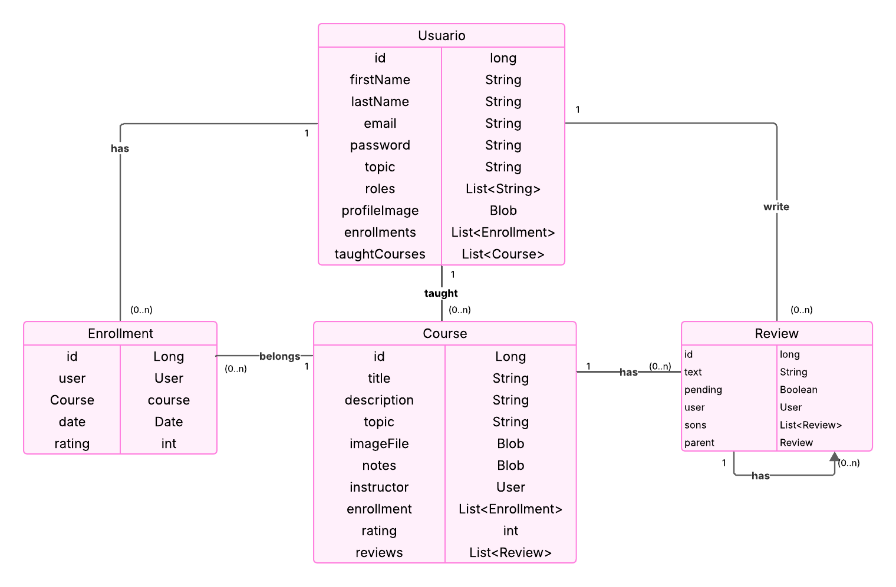
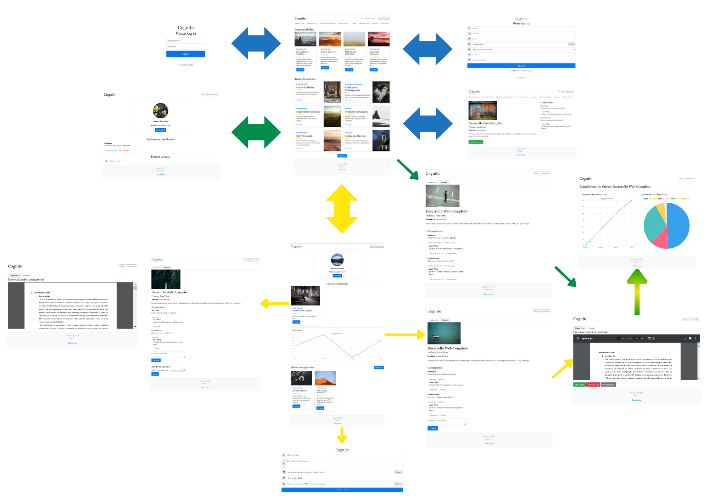
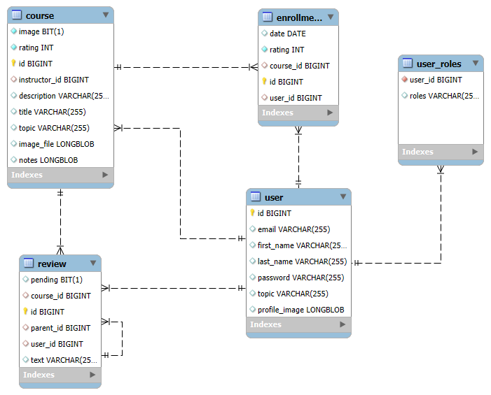
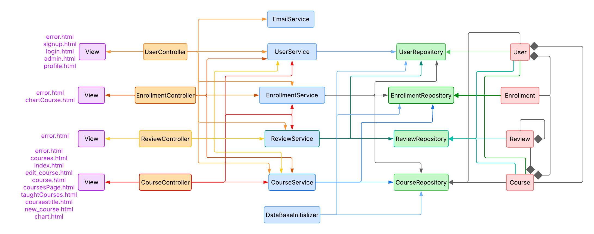

# Nombre de la aplicación: Cognite
## Integrantes:
| Nombre    | Email     | Github      |
|:-------------|:------------:|-------------:|
| Álvaro Fernández González       | a.fernandezgo.2020@alumnos.urjc.es       | [alvaro-f-g](https://github.com/alvaro-f-g)       |
| Gonzalo Fernández González       | g.fernandezg.2020@alumnos.urjc.es       | [gonfergon](https://github.com/gonfergon)     |
| Eloy de Sande de las Heras     | e.desande.2021@alumnos.urjc.es       | [eloydsdlh](https://github.com/eloydsdlh)  |
| Olga Somalo Serrano             |  o.somalo.2021@alumnos.urjc.es           |  [olga-ssf](https://github.com/olga-ssf)     |
| José Víctor García Llorente             |  jv.garcia.2021@alumnos.urjc.es           |  [josevictorgarcia](https://github.com/josevictorgarcia)     |

## Aspectos principales:
- **Entidades**: usuario, inscripción, curso, comentario
  
- **Permisos de usuario**:
  - Usuario registrado: Impartir o recibir cursos, ver y añadir comentarios.
  - Usuario anónimo o no registrado: Ver cursos impartidos, y acceder a las reseñas.
  - Administrador: Puede añadir, borrar o editar cursos y comentarios.
- **Imágenes**: Del perfil de los usuarios, y de los cursos impartidos.
- **Gráficos**: De las cursos recibidos e impartidos por el usuario y de las valoraciones.
- **Tecnología complementaria**: Envío  de correos a los usuarios indicándoles que  han sido registrados correctamente.
- **Algoritmo o consulta avanzada**: Mostrar cursos de interés o afines al usuario(Si se dispone de  tiempo: Filtrar cursos por valoraciónes).

## Capturas de pantalla:
- **Página de inicio**:
  **Descripción:** Es la pantalla principal. Desde ella se podrán observar los cursos disponibles, acceder a la pantalla de registro de usuarios y la de login.
- **Página de registro de usuarios:** Se trata de una página compuesta de un formulario en el cual los usuarios no registrados se darán de alta para poder inscribirse a cursos y hacer un uso más completo de la aplicación.
- **Página de login:** Se trata de otro formulario en el cual el usuario ya registrado introducirá sus credenciales de acceso para acceder a su cuenta.
- **Página de perfil de usuario:** En esta página el usuario registrado podrá editar su perfil, acceder a los cursos en los que se ha inscrito y los que ha subido, cerrar sesión y volver a la página de inicio.
- **Formulario nuevo curso:** Formulario para que los usuarios registrados puedan añadir y crear un nuevo curso. Incluye subida de imágenes y ficheros.
- **Página de curso:**
  - Vista de administrador: El administrador tiene acceso a todos los materiales del curso. Puede editar, eliminar y ver las estadísticas del curso. También puede eliminar comentarios o banear usuarios.
  - Vista de profesor: El profesor tiene acceso a todos los materiales del curso. Puede editar, eliminar y ver las estadísticas del curso. Tiene la opción de añadir, responder o reportar comentarios.
  - Vista de alumno: El alumno tiene acceso a todos los materiales del curso. Puede añadir, responder comentarios y ańadir valoraciones.
  - Vista de usuario no inscrito: Solo tiene acceso a la información del curso, no a los materiales.
- **Página de estadísticas:** Se muestran estadísticas sobre un curso en concreto, por ejemplo la calificación promedio de un curso o el número de inscritos.
- **Página de error:** Se muestra cuando sucede algún tipo de error, mostrando un mensaje para informar al usuario de lo sucedido.

## Diagrama de navegación:
- **Azul:** Todos los usuarios.
- **Amarillo:** Usuarios Registrados.
- **Verde:** Administrador.
- **Nota:** desde cualquier página puedes llegar a la página de error

## Diagrama con las entidades de la base de datos:

## Diagrama de clases y templates:

## Participación:
