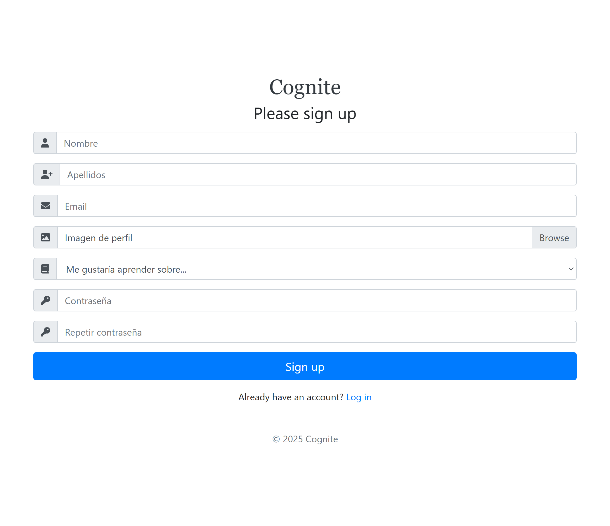
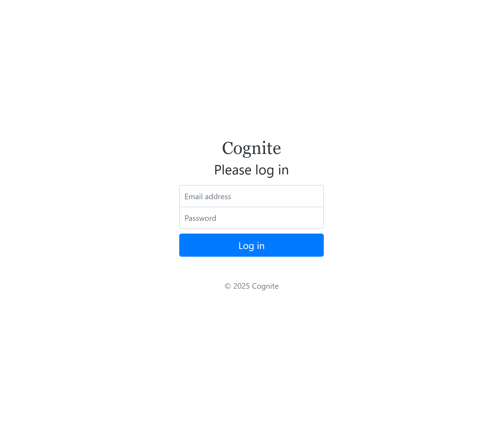
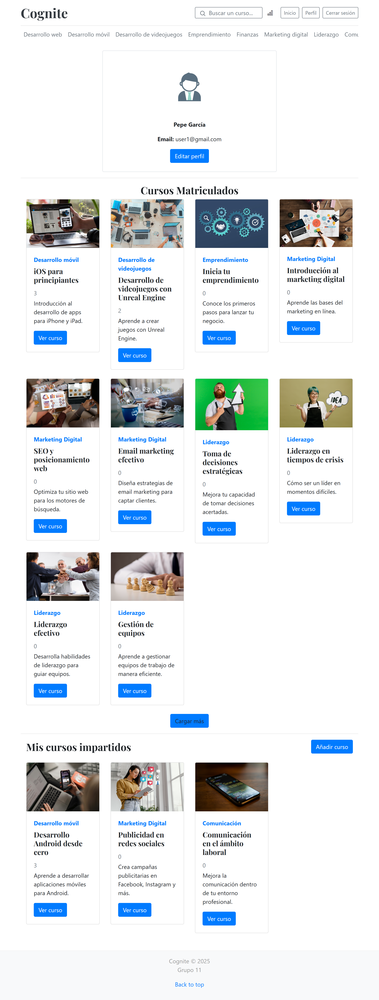
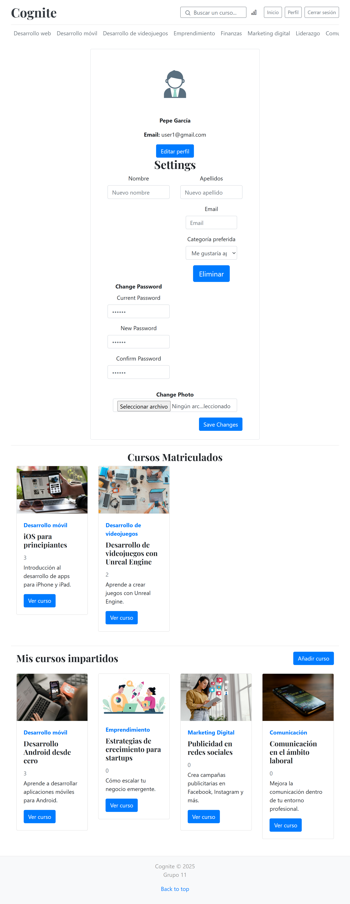
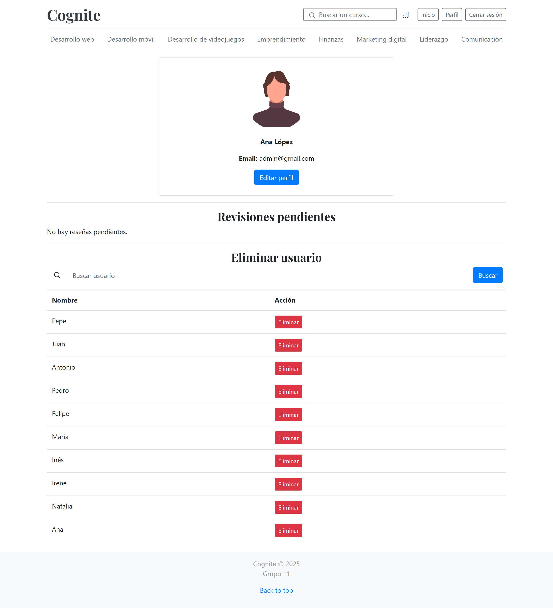
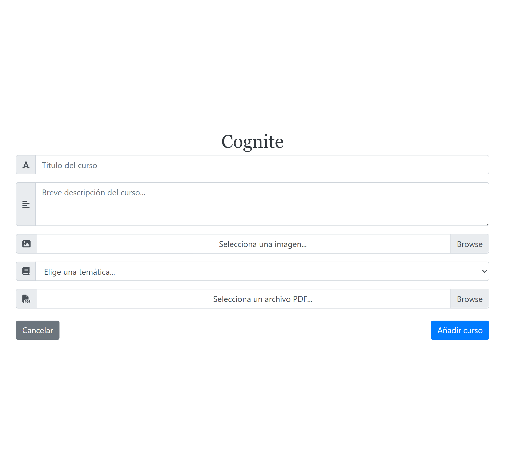
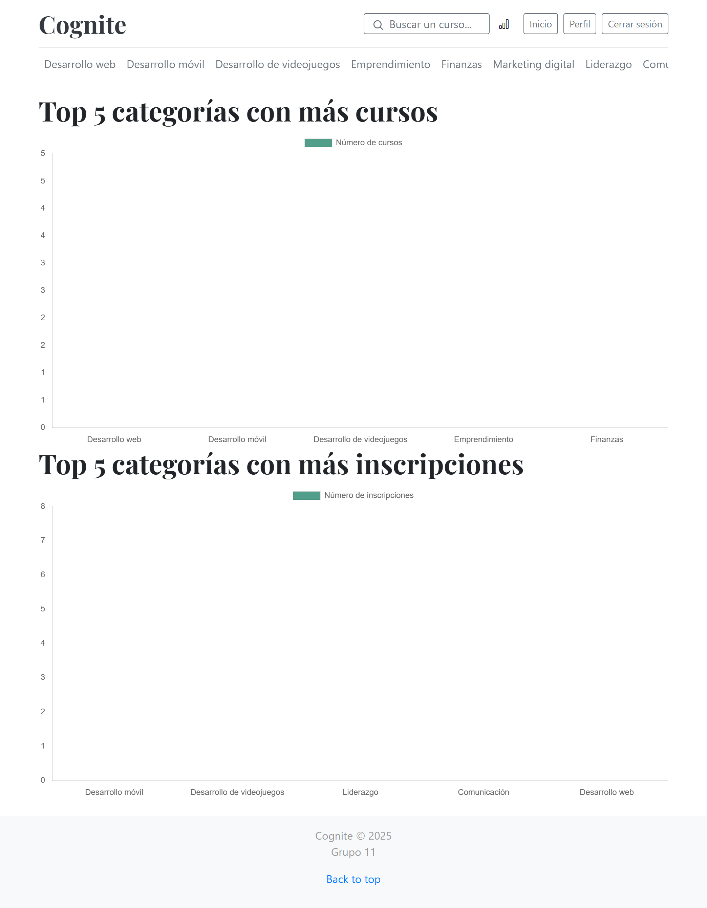
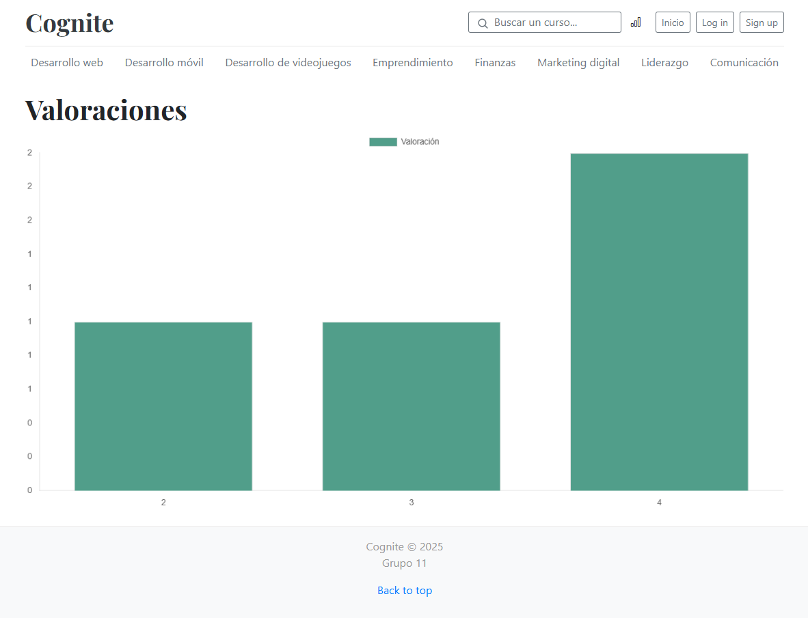
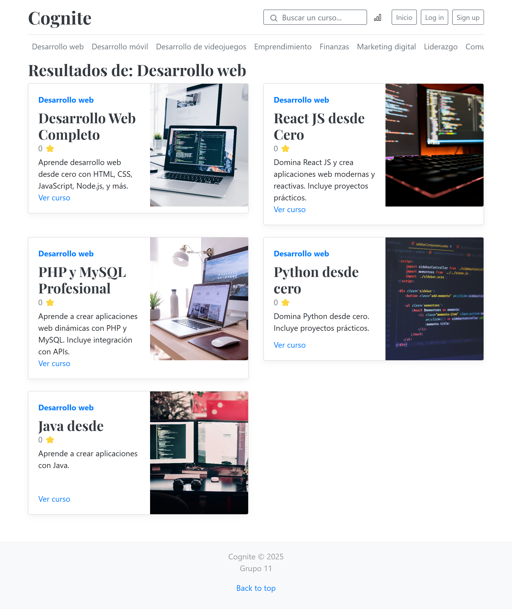
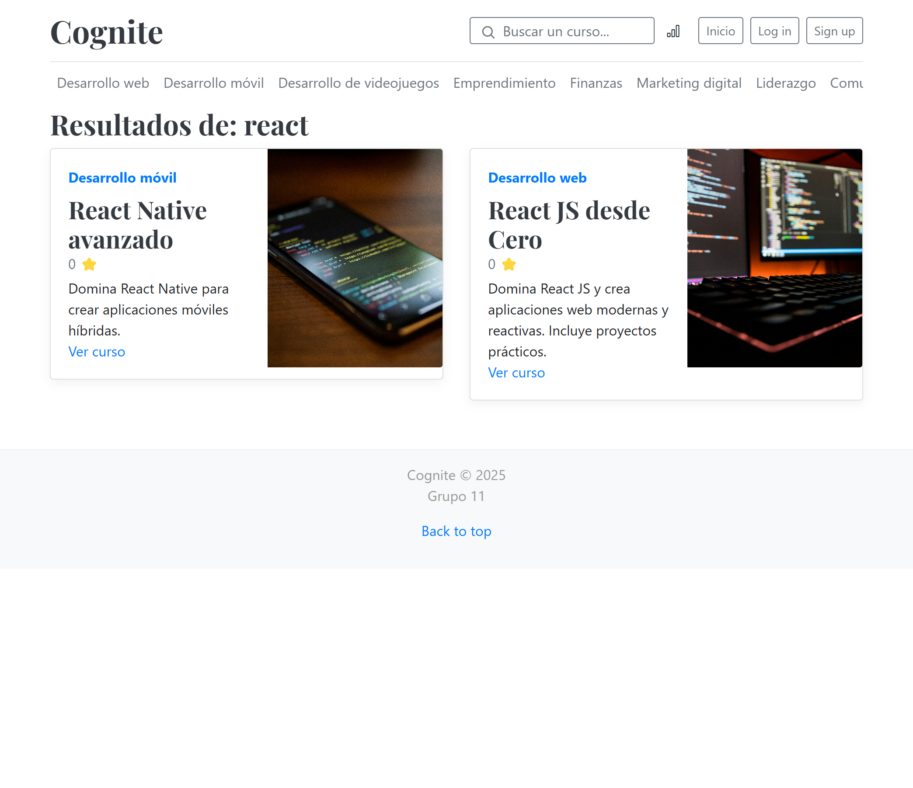

# Nombre de la aplicación: Cognite
## Integrantes:
| Nombre    | Email     | Github      |
|:-------------|:------------:|-------------:|
| Álvaro Fernández González       | a.fernandezgo.2020@alumnos.urjc.es       | [alvaro-f-g](https://github.com/alvaro-f-g)       |
| Gonzalo Fernández González       | g.fernandezg.2020@alumnos.urjc.es       | [gonfergon](https://github.com/gonfergon)     |
| Eloy de Sande de las Heras     | e.desande.2021@alumnos.urjc.es       | [eloydsdlh](https://github.com/eloydsdlh)  |
| Olga Somalo Serrano             |  o.somalo.2021@alumnos.urjc.es           |  [olga-ssf](https://github.com/olga-ssf)     |
| José Víctor García Llorente             |  jv.garcia.2021@alumnos.urjc.es           |  [josevictorgarcia](https://github.com/josevictorgarcia)     |

## Aspectos principales:
- **Entidades**: usuario, inscripción, curso, comentario
  
- **Permisos de usuario**:
  - Usuario registrado: Impartir o recibir cursos, ver y añadir comentarios.
  - Usuario anónimo o no registrado: Ver cursos impartidos, y acceder a las reseñas.
  - Administrador: Puede añadir, borrar o editar cursos y comentarios.
- **Imágenes**: Del perfil de los usuarios, y de los cursos impartidos.
- **Gráficos**: De las cursos recibidos e impartidos por el usuario y de las valoraciones.
- **Tecnología complementaria**: Envío  de correos a los usuarios indicándoles que  han sido eliminados.
- **Algoritmo o consulta avanzada**: Mostrar cursos de interés o afines al usuario, ordenados por valoración.

## Capturas de pantalla:
- **Página de inicio**:
  
  Es la pantalla principal. Desde ella se podrán observar los cursos disponibles, acceder a la pantalla de registro de usuarios y la de login.
- **Página de registro de usuarios:**
  
  Se trata de una página compuesta de un formulario en el cual los usuarios no registrados se darán de alta para poder inscribirse a cursos y hacer un uso más completo de la aplicación.
- **Página de login:**
  
  Se trata de otro formulario en el cual el usuario ya registrado introducirá sus credenciales de acceso para acceder a su cuenta.
- **Página de perfil de usuario:**
  
  
  En esta página el usuario registrado podrá editar su perfil, acceder a los cursos en los que se ha inscrito y los que ha subido, cerrar sesión y volver a la página de inicio.
- **Página de administrador:**
  
  En esta página, solo de acceso al administrador, podrá ver los comentarios reportados por los profesores y actuar frente a estos. También podrá buscar a un usuario para eleiminarle.
- **Formulario nuevo curso:**
  
  Formulario para que los usuarios registrados puedan añadir y crear un nuevo curso. Incluye subida de imágenes y ficheros.
- **Página de curso:**
  - Vista de administrador: El administrador tiene acceso a todos los materiales del curso. Puede editar, eliminar y ver las estadísticas del curso. También puede eliminar comentarios o banear usuarios.
  - Vista de profesor: El profesor tiene acceso a todos los materiales del curso. Puede editar, eliminar y ver las estadísticas del curso. Tiene la opción de añadir, responder o reportar comentarios.
  - Vista de alumno: El alumno tiene acceso a todos los materiales del curso. Puede añadir, responder comentarios y ańadir valoraciones.
  - Vista de usuario no inscrito: Solo tiene acceso a la información del curso, no a los materiales.
- **Página de estadísticas:**
  
  
  Se muestran estadísticas sobre un curso en concreto, por ejemplo la calificación promedio de un curso o el número de inscritos.
- **Página de error:** Se muestra cuando sucede algún tipo de error, mostrando un mensaje para informar al usuario de lo sucedido.
- **Página de categoría:**
  
  Se muestran los cursos de una determinada categoría.
- **Página de búsqueda:**
  
  Se muestras los cursos que contienen en su título y/o categoría la(s) palabra(s) buscadas.
  
## Diagrama de navegación:
- **Azul:** Todos los usuarios.
- **Amarillo:** Usuarios Registrados.
- **Verde:** Administrador.
- **Nota:** desde cualquier página puedes llegar a la página de error


## Diagrama con las entidades de la base de datos:


## Diagrama de clases y templates:


## Instrucciones de Ejecución:  

## 1. Clonar el Repositorio y Configurar el Proyecto en VS Code  
1. ## Abre VS Code 
2. ## Clona el repositorio desde GitHub a través de VsCode (Git: Clone (Clone a repository from the internet)).
3. ## Ingresa la URL del repositorio (puedes copiarla desde GitHub haciendo clic en el botón "Code" > "HTTPS" o "SSH").
4. ## Selecciona la carpeta donde quieres clonar el proyecto.
5. ## Una vez clonado, VS Code te preguntará si quieres abrir el repositorio. Haz clic en "Open".

## 2. Configurar MySQL y Base de Datos 
1. ## Descarga e instala **MySQL Workbench** si no lo tienes.  
2. ## Abre MySQL Workbench y conéctate con:  
   - **Usuario**: `root`  
   - **Contraseña**: `password`  
   - **Puerto**: `3306`  
3. ## Crea el esquema ejecutando este comando en MySQL:  
   ```sql
   CREATE SCHEMA cognite;
   ```

## 3. Configurar y Ejecutar Docker
Si el proyecto utiliza **Docker**, sigue estos pasos para ejecutarlo:  
1. ## Asegúrate de tener Docker instalado (puedes descargarlo desde [Docker](https://www.docker.com/)).  
2. ## Abre el docker desktop** y correlo 


## 4. Ejecutar la Aplicación desde Spring Dashboard en VS Code 
Si el proyecto es una aplicación **Spring Boot**, puedes correrlo directamente desde **Spring Boot Dashboard** en VS Code:  
1. ## Asegúrate de tener instalada la extensión `Spring Boot Extension Pack` en VS Code.  
2. ## Abre la pestaña "Spring Boot Dashboard" en la barra lateral izquierda de VS Code.  
3. ## Selecciona la aplicación en la lista y haz clic en el botón ▶ (Run).  

## 5. Acceder a la Aplicación
Una vez ejecutado el servidor, accede desde el navegador a:  
🔗 **[https://localhost:8443/](https://localhost:8443/)**  


## Participación:
- Eloy de Sande.

  Entre las tareas desarrolladas cabe destacar: creación de las plantillas mustache, inicialización de la base de datos para contar con ejemplos de demostración, implementación del perfil y sus funciones asociadas (listar usuarios, listar comentarios pendientes de revisión, eliminar usuarios, ...), destacando la creación de `EmailService` para notificar a los usuarios que su cuenta ha sido eliminada. Implementación del algoritmo de consulta avanzada, que consiste en mostrar a los usuarios cursos relacionados con su temática de prefencia, atributo que se va actualizando acorde a las inscripciones del usuario.
  
 | Principales Commit | Descripción  | Enlace al Commit |
|--------------------|-------------|------------------|
| **Commit 1** | Creación de plantillas HTML en el directorio `demo/src/main/resources/templates` utilizando el motor de plantillas Mustache. | [Ver commit](https://github.com/CodeURJC-DAW-2024-25/webapp11/commit/eb4dbab69e28da30e0a3144e63682c826ad11da2) |
| **Commit 2** | Se añade la clase `SecurityConfiguration` en el paquete `es.daw.demo.security`, que configura la seguridad de la aplicación utilizando Spring Security. | [Ver commit](https://github.com/CodeURJC-DAW-2024-25/webapp11/commit/59548aba488c7f58f3f4e80db7143c0ea88d68df) |
| **Commit 3** | Se añade funcionalidad de notificación por correo electrónico de la eliminación de cuentas de usuario en la aplicación web. | [Ver commit](https://github.com/CodeURJC-DAW-2024-25/webapp11/commit/911b4e7e2efa6a91869b452f7d507f0c7ae2a749) |
| **Commit 4** | Se introducen mejoras en los servicios `EnrollmentService` y `ReviewService`. Se añaden nuevas funcionalidades o mejoras en la lógica de negocio de estos servicios para la gestión de inscripciones y revisiones dentro de la aplicación. | [Ver commit](https://github.com/CodeURJC-DAW-2024-25/webapp11/commit/a003aa65ebb25bfe120f271ff668d4c341d86847) |
| **Commit 5** | Se introducen funcionalidades de administración, permitiendo a los usuarios con rol de administrador acceder a una vista específica (`admin`) desde su perfil. Se añade una nueva ruta `/admin/users` que muestra una lista de usuarios, con la opción de filtrar por nombre, y se implementa la capacidad de eliminar usuarios mediante la ruta `/admin/users/delete/{id}`. | [Ver commit](https://github.com/CodeURJC-DAW-2024-25/webapp11/commit/cb1b624b6b906ee91eb8eab60d9a83abb49cabb0) |

  
  | Principales archivos | Enlace al archivo |
  |----------------------|-------------------|
  |EnrollmentController|[Ver archivo](demo/src/main/java/es/daw/demo/controller/EnrollmentController.java)|
  |User|[Ver archivo](demo/src/main/java/es/daw/demo/model/User.java)|
  |EmailService|[Ver archivo](demo/src/main/java/es/daw/demo/service/EmailService.java)|
  |UserService|[Ver archivo](demo/src/main/java/es/daw/demo/service/UserService.java)|
  |DataBaseInitializer|[Ver archivo](demo/src/main/java/es/daw/demo/service/DataBaseInitializer.java)|

  - Olga Somalo Serrano.

  Entre las tareas desarrolladas cabe destacar: inicialización de la base de datos, implementación del botón de cargar más elementos (tanto en la página principal como en el perfil). Implementación de las funcionalidades de borrar y editar cursos, así como borrar y editar perfil. Implemetación de las gráficas: top 5 categorías con más cursos, top 5 categorías con más incripciones y valoraciones de los cursos.

   | Principales Commit | Descripción  | Enlace al Commit |
|--------------------|-------------|------------------|
| **Commit 1** | Se añaden las funcionalidades de borrar y editar perfil añadiendo un formaulario en la página de perfil. | [Ver commit](https://github.com/CodeURJC-DAW-2024-25/webapp11/commit/a356e4921b97a085cd8a35cfec27833e33b5ca8c) |
| **Commit 2** | Se añade la gráfica de top 5 categorías con más cursos. | [Ver commit](https://github.com/CodeURJC-DAW-2024-25/webapp11/commit/b26abd00eddd5fd53b2bcfd8406d5b050cc21c83) |
| **Commit 3** | Se añade la funcionalidad de editar los cursos. | [Ver commit](https://github.com/CodeURJC-DAW-2024-25/webapp11/commit/ff1e2f92039c8d73a9c2ad7054678c08cee2588a) |
| **Commit 4** | Se añade la gráfica de categorías con más inscripciones. | [Ver commit](https://github.com/CodeURJC-DAW-2024-25/webapp11/commit/8d65f6aa320d6a1ff73d7d08a90d189edd078ff9) |
| **Commit 5** | Se añade la funcionalidad del botón de cargar más cursos en la página principal. | [Ver commit](https://github.com/CodeURJC-DAW-2024-25/webapp11/commit/cc029e895e93693e20547cb754e89eb98cce4a34) |

| Principales archivos | Enlace al archivo |
  |----------------------|-------------------|
  |charts.js|[Ver archivo](https://github.com/CodeURJC-DAW-2024-25/webapp11/blob/main/demo/src/main/resources/static/js/charts.js)|
  |app.js|[Ver archivo](https://github.com/CodeURJC-DAW-2024-25/webapp11/blob/main/demo/src/main/resources/static/js/app.js)|
  |chartsCourse.js|[Ver archivo](https://github.com/CodeURJC-DAW-2024-25/webapp11/blob/main/demo/src/main/resources/static/js/chartsCourse.js)|
  |CourseController|[Ver archivo](https://github.com/CodeURJC-DAW-2024-25/webapp11/blob/main/demo/src/main/java/es/daw/demo/controller/CourseController.java)|
  |UserController|[Ver archivo](https://github.com/CodeURJC-DAW-2024-25/webapp11/blob/main/demo/src/main/java/es/daw/demo/controller/UserController.java)|

  - José Víctor García Llorente.

  Entre las tareas desarrolladas cabe destacar: Implementación de la actualización y modificación del perfil de un usuario, así como el borrado de su cuenta. Creación de plantillas en páginas de error y estadísticas. Funcionalidades de añadir reviews y enlazar sub-reviews y mostrar la página de curso en función del tipo de usuario.


| Principales Commit | Descripción  | Enlace al Commit |
|--------------------|-------------|------------------|
| **Commit 1** | Actualización y modificación del perfil del administrador. Cambios en la configuración de rutas. | [Ver commit](https://github.com/CodeURJC-DAW-2024-25/webapp11/commit/60ff7660aac43ebda35eb584e26af767e5b8cd36) |
| **Commit 2** | Implementación de la plantilla de la página de error y estadísticas. | [Ver commit](https://github.com/CodeURJC-DAW-2024-25/webapp11/commit/c838b77b6899c55d1d831fa7621840ace17a436a) |
| **Commit 3** | Borrado del usuario desde el perfil. | [Ver commit](https://github.com/CodeURJC-DAW-2024-25/webapp11/commit/cbf52aec56912b6f319ffa7e340d085eb381b9c2) |
| **Commit 4** | Funcionalidad de añadir reviews y comentarios a los cursos. Enlace de las sub-reviews a las reviews. | [Ver commit](https://github.com/CodeURJC-DAW-2024-25/webapp11/commit/9ec686a013b5658640006b1494641fc19e2608ed) |
| **Commit 5** | Funcionalidad de mostrar página de un curso según el tipo de usuario. | [Ver commit](https://github.com/CodeURJC-DAW-2024-25/webapp11/commit/cbda04e7c6eff06a851e14480700dd9c3147d982) |

| Principales archivos | Enlace al archivo |
  |----------------------|-------------------|
  |UserController|[Ver archivo](https://github.com/CodeURJC-DAW-2024-25/webapp11/blob/main/demo/src/main/java/es/daw/demo/controller/UserController.java)|
  |ReviewController|[Ver archivo](https://github.com/CodeURJC-DAW-2024-25/webapp11/blob/main/demo/src/main/java/es/daw/demo/controller/ReviewController.java)|
  |WebSecurityConfig|[Ver archivo](https://github.com/CodeURJC-DAW-2024-25/webapp11/blob/main/demo/src/main/java/es/daw/demo/security/WebSecurityConfig.java)|
  |CourseController|[Ver archivo](https://github.com/CodeURJC-DAW-2024-25/webapp11/blob/main/demo/src/main/java/es/daw/demo/controller/CourseController.java)|
  |admin.html|[Ver archivo](https://github.com/CodeURJC-DAW-2024-25/webapp11/blob/main/demo/src/main/resources/templates/admin.html)|

  - Álvaro Fernández González

Entre las contribuciones realizadas por mi, cabe destacar la creación de controladores y repositorios para ciertas entidades como la del user, la creación de enitdad de reseñas para ser tratada en la BBDD, añadir todas las rutas de seguridad necesarias, añadir la seguridad CSRF en la edición de las reseñas, así como hacer el cógido más legible comprobando que todo estuviera en mismo idioma (inglés) entre otras contribuciones. A continuación, se presentan los principales commits realizados en el proyecto, junto con una breve descripción de los cambios introducidos en cada uno y un enlace al commit correspondiente:  

| **Principales Commit** | **Descripción** | **Enlace al Commit** |
|--------------------|-------------|------------------|
| **Commit 1** | Se añaden todas las rutas necesarias para los usuarios en la configuración de seguridad web. | [Ver commit](https://github.com/CodeURJC-DAW-2024-25/webapp11/commit/f5c0b0be0ac019b84a264d3bf02779b8629f5141)|
| **Commit 2** | Se añaden el controlador y el repositorio para gestionar los usuarios en la aplicación. | [Ver commit](https://github.com/CodeURJC-DAW-2024-25/webapp11/commit/42e3ea249cfeab34de231d5a55b659feae4921fa)|
| **Commit 3** | Se crea la entidad `Comment` para gestionar los comentarios dentro de la aplicación. | [Ver commit](https://github.com/CodeURJC-DAW-2024-25/webapp11/commit/f51229c03e79382b1bfee432d4e114a61ea7dc26)|
| **Commit 4** | Se añade protección CSRF en la edición de revisiones para mejorar la seguridad de la aplicación. | [Ver commit](https://github.com/CodeURJC-DAW-2024-25/webapp11/commit/6706a0cbfa0ba525fa1a1a573dedc5ef3ce9b28d)|
| **Commit 5** | Se traducen comentarios, funciones y otros elementos del código de español a inglés para mejorar la consistencia del proyecto. | [Ver commit](https://github.com/CodeURJC-DAW-2024-25/webapp11/commit/7a4fb41eb766a7b3ed4e527aa1ad68b35deabe8c)|

| Principales archivos | Enlace al archivo |
  |----------------------|-------------------|
  |EnrollmentController|[Ver archivo](https://github.com/CodeURJC-DAW-2024-25/webapp11/blob/main/demo/src/main/java/es/daw/demo/controller/EnrollmentController.java)|
  |EnrollmentRepository|[Ver archivo](https://github.com/CodeURJC-DAW-2024-25/webapp11/blob/main/demo/src/main/java/es/daw/demo/controller/EnrollmentController.java)|
  |ReviewController|[Ver archivo](https://github.com/CodeURJC-DAW-2024-25/webapp11/blob/main/demo/src/main/java/es/daw/demo/repository/EnrollmentRepository.java)|
  |WebSecurityConfig|[Ver archivo](https://github.com/CodeURJC-DAW-2024-25/webapp11/blob/main/demo/src/main/java/es/daw/demo/security/WebSecurityConfig.java)|
  |Review|[Ver archivo](https://github.com/CodeURJC-DAW-2024-25/webapp11/blob/main/demo/src/main/java/es/daw/demo/model/Review.java)|


-Gonzalo Fernández González

Entre las tareas realizadas cabe destacar: implementación del CourseRepository, implementación del CourseController, implementación del ReviewController, implementación del Enrollment service, implementación del Review service, implementación de botón para mejor navegabilidad, implementación para editar y borrar reseñas y agregación de formularios para editar y eliminar revisiones, refactorizar el personal de revisión en el curso y revisar controladores, corrección del botón Back to Courses.

   | Principales Commit | Descripción  | Enlace al Commit |
|--------------------|-------------|------------------|
| **Commit 1** |CourseController added | [Ver commit](https://github.com/CodeURJC-DAW-2024-25/webapp11/commit/e1715a0c6d832ec27911eb670a03d80cdf946cc9#diff-40e9664b7caf569650acacc7ff7e5227eb10059056ff75abc51433aeb4607c46) |
| **Commit 2** |Enrollment service added  | [Ver commit](https://github.com/CodeURJC-DAW-2024-25/webapp11/commit/beb89f56116ad569545ce3dd27376266cbdae7b4#diff-1f61c6528348e5faee4036bb781c7984d200a8297d18e1a5421722b1bcb5da1b) |
| **Commit 3** |Review service added | [Ver commit](https://github.com/CodeURJC-DAW-2024-25/webapp11/commit/782268940673fdd43f2b2f5cb5b42df76fa0c713#diff-b2aa078e0484e59e1b3b50f7c6777685b54051d60a63ad20be3a261bff1519df) |
| **Commit 4** |ReviewController added  | [Ver commit](https://github.com/CodeURJC-DAW-2024-25/webapp11/commit/4e2f79a5fea35c0f069e0a6f1e46c1f10b7e62c8#diff-db091f5cbad61dea1e59332a89061055fb18cd97737600324db0d0395107841d) |
| **Commit 5** |add forms to edit and delete review, refactor review staff in course and review controllers | [Ver commit](https://github.com/CodeURJC-DAW-2024-25/webapp11/commit/a9dfc042ed62f1c4b5de9aa77e264219302e75ad#diff-40e9664b7caf569650acacc7ff7e5227eb10059056ff75abc51433aeb4607c46)|[Ver commit](https://github.com/CodeURJC-DAW-2024-25/webapp11/commit/a9dfc042ed62f1c4b5de9aa77e264219302e75ad#diff-5d9357e33602093934d00045974812a477823ccea20dfe5b2a0826977961aa5f)|[Ver commit](https://github.com/CodeURJC-DAW-2024-25/webapp11/commit/a9dfc042ed62f1c4b5de9aa77e264219302e75ad#diff-5d9357e33602093934d00045974812a477823ccea20dfe5b2a0826977961aa5f) |


| Principales archivos | Enlace al archivo |
  |----------------------|-------------------|
  |ReviewController|[Ver archivo](https://github.com/CodeURJC-DAW-2024-25/webapp11/commit/4e2f79a5fea35c0f069e0a6f1e46c1f10b7e62c8#diff-db091f5cbad61dea1e59332a89061055fb18cd97737600324db0d0395107841d)|
  |CourseController|[Ver archivo](https://github.com/CodeURJC-DAW-2024-25/webapp11/commit/e1715a0c6d832ec27911eb670a03d80cdf946cc9#diff-40e9664b7caf569650acacc7ff7e5227eb10059056ff75abc51433aeb4607c46)|
  |Admin|[Ver archivo](https://github.com/CodeURJC-DAW-2024-25/webapp11/commit/a9dfc042ed62f1c4b5de9aa77e264219302e75ad#diff-3af6ce49f8a0478fa6d38bcbd811f1b6688ce9c4300a28f35fa09c6e3a93526b)|
  |Enrollment service|[Ver archivo](https://github.com/CodeURJC-DAW-2024-25/webapp11/commit/beb89f56116ad569545ce3dd27376266cbdae7b4#diff-1f61c6528348e5faee4036bb781c7984d200a8297d18e1a5421722b1bcb5da1b)|
  |Review service|[Ver archivo](https://github.com/CodeURJC-DAW-2024-25/webapp11/commit/782268940673fdd43f2b2f5cb5b42df76fa0c713#diff-b2aa078e0484e59e1b3b50f7c6777685b54051d60a63ad20be3a261bff1519df)|
